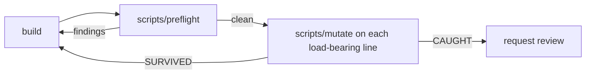

# Build discipline

A build lane loads this the way a reviewer loads review policy. Every class below
was found by hand in a review of this repository, more than once, because each
fresh builder starts from a clean context and rediscovers it. The checks exist so
the rediscovery is mechanical rather than lucky.



## Running the gate

```bash
scripts/preflight                      # everything touched since origin/main
scripts/preflight --base main          # against another ref
scripts/preflight --paths-from FILE    # an explicit path list, one per line
scripts/preflight --slice review       # also run a slice, judged by its counts

scripts/bash-status-check FILE...      # the shell status-leak check alone

scripts/mutate --file src/thing.ts \
  --replace 'escapeHtml(name)' --with 'name' \
  --test 'bun test tests/thing.test.ts'
```

`preflight` reads the touched set from git — committed, staged, unstaged and
untracked — and checks only those files. It exits 1 on any finding. Nothing in it
calls a model; the same input gives the same answer.

`mutate` exits 0 CAUGHT, 1 SURVIVED, 2 usage, 3 harness fault. It restores from a
scratch copy and verifies the digest, so it never needs git to undo itself.

## The catalogue

### Silent status leak from `cond && action`

**Mechanism.** Under `set -euo pipefail` a conditional-and compound drops a
failure in one of two ways, confirmed against real bash rather than assumed:

- **tail-leak** — as the last command of a function, the compound's status
  becomes the function's return status. Called in statement position, the caller
  dies immediately with no message.
- **soft-gate** — anywhere else, `set -e`'s AND-list exemption swallows the
  failure and execution continues past a check that did not pass.

The two harms are opposite — one aborts silently, one proceeds silently — and
both read as success to whoever wrote the line.

**Seen as.** A persisted-group reader whose loop body was
`group_declared "$entry" && printf ...`: one unrecognised entry in a state file
killed the whole installer with no output, and only when that entry happened to
be last, so the failure was order-sensitive. Separately, a plugin validation loop
written `plugin validate "$dir" && echo 'manifest valid'`, where an invalid
manifest was swallowed and the sync continued to completion. Both were blockers;
both were one line.

**Caught by.** `scripts/bash-status-check`, run over touched shell files by
`preflight`. Repair with an explicit `if ! cond; then ... fi`, and close a
function with `return 0` when its last command is a predicate.

Note on shellcheck: `preflight` runs it when installed, but it is not the
detector for this class and the gate does not depend on it being present.

### A load-bearing line with no test

**Mechanism.** An escape, a path pin, a flag branch: correct when written, and no
test fails if it is deleted. The line survives until the next refactor removes it,
and the suite stays green through the removal.

**Seen as.** Replacing an escaping call on a rendered field with the raw value
left the suite at 134 pass / 0 fail while putting live `<script>` into the
document. A comment stating a bundled theme path must be used "never the local
clone" was enforced by that comment alone — repointing it at an absolute clone
path left all six tests passing. A CLI entry point that both shipped scaffolds
invoked had no test at all.

**Caught by.** Nothing static. `scripts/mutate` is the answer: mutate each
load-bearing line before requesting review, and treat SURVIVED as a missing test
rather than a passing one. Aim the mutation at the behaviour, not the character —
a fixture too small to distinguish the mutation makes a weak probe look like a
strong test.

### A suite that exits clean without running

**Mechanism.** The runner dies before executing anything — a lock it cannot take,
an environment variable scrubbed out from under it — and exits without printing a
result marker. A caller reading `$?` sees success.

**Seen as.** Reviewers on this repository judge suites by the printed
`N pass / N fail` line for exactly this reason, and record the number rather than
the exit status. A run reporting no marker is not a pass.

**Caught by.** `scripts/lib/test-verdict.sh`, shared by `preflight --slice` and by
`mutate`: absence of a marker is its own verdict, reported as a harness fault,
never as green. Reading `$?` after a pipeline compounds this — the status is the
last command's, not the runner's.

### A test that writes the real `$HOME`

**Mechanism.** A test spawns a subprocess with the inherited environment and no
`HOME` override, so an installer under test writes the developer's actual home
directory instead of a temporary one.

**Seen as.** Installer suites here run against temporary homes deliberately; the
convention is a spawn helper that sets `HOME` and `XDG_CONFIG_HOME` to a
`mkdtemp` root. A helper that spreads the parent environment without that
override silently escapes the sandbox.

**Caught by.** `preflight`'s home-escape check: a test file that names an
installer in code, spreads `process.env`, and never sets `HOME`.

### `dprint` with an empty file list

**Mechanism.** Invoked with no paths, dprint falls back to its configured
includes and reformats the whole repository, burying the actual change in
unrelated churn.

**Seen as.** Unrelated formatting churn arriving in a branch — a quote style
changed in a CI file the change never touched — is the visible symptom.

**Caught by.** `preflight`'s bare-dprint check flags an invocation with no file
list. `preflight` also declines to run its own format check when the touched set
contains no formattable file, rather than invoking dprint bare.

### A second scanner shadowing the real parser

**Mechanism.** A check re-implements a lightweight scan of a format that a real
parser already handles. The two disagree on some input, and the more lenient one
decides.

**Seen as.** Two readers of one manifest resolving a duplicated membership line
differently — the shell reader returned the first match, the TypeScript reader
kept the last — with nothing rejecting the duplicate, so the installer and the
test oracle disagreed about what was installed. Separately, a container-closure
check that compared open and close tag _totals_ read a close followed by a
sibling open as still-open; the repair was to walk tags in document order with a
depth counter.

**Caught by.** Nothing static. Pin the two readers to each other with shared
fixtures, including hostile ones, and assert they agree — the repository has a
manifest-readers test doing exactly this. Where a real parser exists, prefer it
over a second scan.

### The fix introduces a new defect

**Mechanism.** A round-two fix is correct for the reported symptom and wrong
somewhere new. Reviewing only the original finding misses it.

**Seen as.** A multi-line quote fix that handled LF and left a lone CR escaping
every container. An escape character class that omitted the backslash, so a field
ending in one broke the inline element that followed. Provenance rendering added
_by_ a fix, introducing two unescaped interpolations that no test sampled.

**Caught by.** Nothing static. Review the delta at the new head as a change in its
own right, and re-run the previous round's mutations rather than trusting that
they still fail.

### A mutation restored with git

**Mechanism.** Reverting a mutation with `git checkout --` or `git restore`
discards whatever else was uncommitted in that file — in a shared clone, another
session's work.

**Caught by.** `preflight`'s restore check flags those invocations in touched
files. `scripts/mutate` restores from a scratch copy and verifies the digest
afterwards; it also refuses to mutate itself, because bash reads a running script
lazily and rewriting it mid-run corrupts the run instead of testing it.

### Plugin mirror drift

**Mechanism.** `skills/` and `plugins-cc/agentkit/skills/` must stay
byte-identical. Editing one without the other ships a plugin whose copy of a
skill differs from the source of truth.

**Seen as.** Reviewers verify this by digest on every touched skill file, every
round, because the mirror is generated and easy to forget.

**Caught by.** `preflight`'s mirror check compares each touched skill file with
its counterpart in both directions. Repair by running `scripts/sync-cc-plugin.sh`
and committing the result; never edit the mirror directly.

### An unrouted test file

**Mechanism.** A new test file that no slice claims runs in the full suite and in
no CI slice, so the targeted job that should guard it stays green while the
behaviour is unguarded.

**Caught by.** `preflight` delegates to `scripts/check-test-slices.ts --check`,
which also fails on an executable or shebang-bearing file that no test task's
inputs match. Route new test files in `TEST_SLICES` and new tooling in `moon.yml`.

### A harness fault read as a result

**Mechanism.** The probe environment is broken, and its uniform answer is mistaken
for a finding about the code.

**Seen as.** A `PATH` override built for an SSRF probe also hid the runtime, so
every case exited 127 and the target looked comprehensively blocked. Separately, a
full-suite run launched concurrently with a mutation job against the same
worktree reported two failures that belonged to the mutation, not the branch.

**Caught by.** Nothing static. Positive-control the instrument: make it fail
first, on purpose, and only then trust a clean result. Serialise mutation runs
against a worktree — a suite and a mutation cannot share one. `scripts/mutate`
enforces the first half of this by treating a mutation that did not change the
file as a fault rather than a survival.
