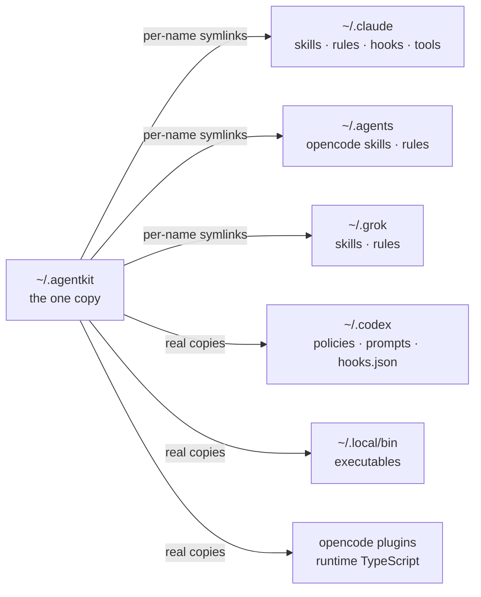

An agent will force-push to `main`, reformat your whole repository to fix one file, and report
"all tests pass" over a suite that never ran. Writing "don't do that" in a config file does not
stop it. The instruction is advice, and advice is skippable.

agentkit's position is that working discipline has to be **executable**: a hook that refuses at the
tool call, a gate that denies the merge, a runner that makes exceeding a memory limit impossible.
Everything in the kit is machinery. None of it depends on the agent remembering.

## The shape of it

One canonical copy of skills, rules, instructions, hooks and tools under `~/.agentkit`, then
per-client adapters into four harnesses — OpenCode, Claude Code, Codex CLI and Grok CLI. Skills and
rules are symlinked, so editing the canon reaches every client that links it. Codex prompts, the
OpenCode TypeScript plugins and the executables on your `PATH` are real copies, refreshed on the
next install run.

Nothing sweeps a client directory. Skills from other sources sit untouched alongside.

## Four surfaces, in order of force

Each surface trades reach for force. What arrives everywhere can only advise; what cannot be
skipped acts at exactly one point.

| Surface   | Reach                            | Ignored on a Friday evening, the result is |
| --------- | -------------------------------- | ------------------------------------------ |
| **Skill** | loaded on demand, agent's choice | the work is worse                          |
| **Rule**  | always-on context, glob-tagged   | bad habits land, and show up in review     |
| **Hook**  | refuses at the tool call         | nothing — ignoring it is not possible      |
| **Tool**  | replaces the capability itself   | nothing — the limit is in the kernel       |

Climb only as high as the failure justifies. [Four surfaces](/docs/guide/concepts/surfaces/) explains the
mechanics; [thinking in agentkit](/docs/guide/thinking/) is the judgment call about which one a given
piece of discipline deserves.

## The enforcement, concretely

 police units exist across three enforcement mechanisms: Claude-format hook
scripts (also loaded by Grok through its Claude-compatibility path), OpenCode TypeScript plugins,
and Codex exec policies. Coverage is deliberately uneven — a mechanism gets a unit only where it
can express the check.



Between them they refuse force pushes, `--no-verify`, AI-attribution trailers, commits to protected
branches, package-manager commands that disagree with the project's lockfile, unbounded heavy builds
on Linux, `kubectl apply` on Kargo CRDs, stacked merge requests, oversized files and functions,
duplicated blocks, and comments carrying references that rot. Every refusal names the legitimate
override.

Two units — `resource` and `delegation` — enforce nothing under the default configuration, and
`review` ships only with an explicit kit. See [configuration](/docs/reference/configuration/) for turning
them on.

## What the guards cover

agentkit is built against ordinary failure — the wrong command, the skipped step, the stale review —
which is what almost every failure is. It is not a sandbox, and the boundary is worth knowing
precisely:


A guard you wrongly believe in is worse than no guard, because you stop watching.
[Boundaries](/docs/guide/concepts/boundaries/) states every limit in one place.


- Hooks are **guards**: they detect a pattern in a tool call and refuse it. An effect written a
  different way is outside what a given guard matches.
- Codex policies match literal argv prefixes rather than parsing shell payloads, so work delegated
  through an API or a socket is outside their reach.
- The review record lives in the repository and the agent can write it. The gate makes the honest
  path correct and a _stale_ review mechanically impossible to merge past; forge-side required
  approvals are what actually prevent a merge.
- Containment deliberately excludes delegated workloads — `docker`, `podman`, `systemd-run`, `ssh` —
  because the child work can escape the cgroup.

## Start here







