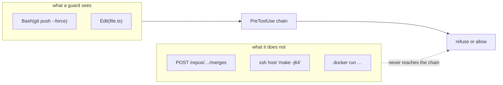

Every limit the kit has, in one place. This page exists because a guard you wrongly believe in is
worse than no guard: you stop watching.

Each limit below is also stated where the feature is documented. Repetition is deliberate — nobody
should have to come looking for it.

## What agentkit is not

| It is not                      | Because                                                                      |
| ------------------------------ | ---------------------------------------------------------------------------- |
| a sandbox                      | hooks match patterns in tool calls and refuse; they do not isolate a process |
| a security boundary            | the review record lives in the repository and the agent can write it         |
| a shell parser, on Codex       | Codex policies match literal argv prefixes                                   |
| a container for delegated work | `docker`, `podman`, `systemd-run` and `ssh` escape the cgroup                |
| a guarantee any command ran    | a review record's `checks` block is a claim, not an observation              |

## Guards are detection, not isolation

A police hook detects a pattern in a tool call and refuses it. That covers the _convenient wrong
path_, which is the path an agent actually takes — and almost every failure is an ordinary one.

It does not cover:

- a script that speaks HTTP directly instead of running a CLI
- work delegated into a container, over `ssh`, or through an API or socket
- an effect written a different way than the pattern the guard matches

## Per-mechanism reach

| Mechanism          | Sees                                           | Cannot see                            |
| ------------------ | ---------------------------------------------- | ------------------------------------- |
| Claude / Grok hook | the whole tool payload, once, before execution | anything not expressed as a tool call |
| OpenCode plugin    | the same payload, in TypeScript                | the same                              |
| Codex exec policy  | literal argv prefixes                          | shell payloads, nesting, substitution |

Where the Codex policy cannot express a narrow rule it is deliberately made **broader**, refusing
whole classes outright rather than pretending to inspect them.

## Failure directions

A guard that cannot run has to choose, and the choice is per-unit and deliberate.

| Unit              | On its own failure                                    |
| ----------------- | ----------------------------------------------------- |
| `resource-police` | allows, loudly, once                                  |
| `mr-police`       | allows, quietly — there is nothing to compare against |
| `version-police`  | allows on any registry error                          |
| `format-police`   | skips with a warning when `dprint` is absent          |
| `review-police`   | **denies**                                            |

The convention is fail open for detection and fail closed for the gate. The rule is not "never fail
open" — it is **never fail silent**.


A `PreToolUse` hook that crashes emits no decision, and **no decision means allow**. That is the
harness contract, not an agentkit choice. It is why `review-police` runs behind a supervisor, and why
[verify the install](/docs/guide/start/verify/) drives a hook by hand rather than trusting a file listing.


## What the merge gate proves

The gate proves **binding**: a review record satisfies it only when the record's context matches the
forge's exact source and target SHAs and the digest of the policy read from the target commit. That
makes the honest path correct and a _stale_ review mechanically impossible to merge past by accident.

It is a consistency gate, not an authentication one. It does **not** attest:

- reviewer identity, or that the reviewer was a different model family
- that a recorded command actually ran
- that evidence was redacted
- that a referenced link says what the record claims

**Forge-side required approvals are what actually prevent a merge.** The gate is designed to sit
alongside them, not to replace them.

## Containment excludes delegated workloads

`bounded-run` puts a command in a transient systemd scope under a cgroup with hard limits. Child work
that leaves that scope is not contained, so `docker`, `podman`, `systemd-run` and `ssh` are excluded
by design rather than wrapped and hoped for.

`resource-police` trusts the runner by its **installed path**, not by its name — otherwise a shell
function called `bounded-run` could neuter every limit while the denial message congratulated it.
`AGENTKIT_ALLOW_DELEGATED=1` does not clear that particular refusal.

Off Linux there is no cgroup containment at all: `bounded-run` is not installed, and the units that
reference it stand down.

## Several skills are not forge-neutral

The kit is generic about discipline and specific about tooling. Assuming otherwise is how a playbook
silently stops applying.

| Skill                     | Actually requires                                       |
| ------------------------- | ------------------------------------------------------- |
| `issue-raiser`            | **GitLab only** — every forge command is `glab`         |
| `gitlab-issue-lifecycle`  | GitLab work items and merge requests                    |
| `github-issue-lifecycle`  | GitHub issues and Projects v2                           |
| `clickup-task-lifecycle`  | ClickUp, and repo-local `agentkit.clickup.*` git config |
| `gitops-master`           | ArgoCD **and** Kargo                                    |
| `resource-safe-execution` | Linux, systemd user scopes, cgroup v2                   |

There is no GitHub counterpart to `issue-raiser`'s research lane.
