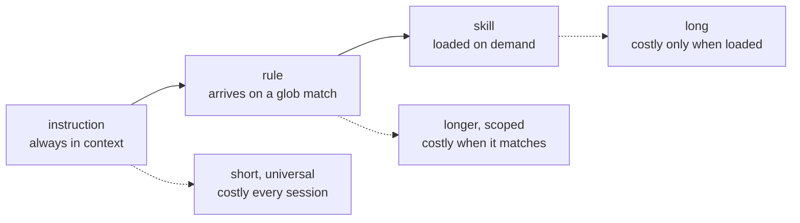

Skills load on demand. Rules and instructions are the layers that are already there — the context an
agent has before it decides anything.

| Layer                            | Loaded when                | Scoped by                   | Lives in        |
| -------------------------------- | -------------------------- | --------------------------- | --------------- |
| Rules                            | a matching file is in play | a glob in the frontmatter   | `rules/`        |
| Instructions                     | every session              | nothing — always on         | `instructions/` |
| [Skills](/guide/concepts/skills/) | the agent invokes one      | its own trigger description | `skills/`       |

## Rules: markdown with a glob

 rules ship, each a markdown file whose frontmatter carries a `globs` key:




**The client reads the glob, not agentkit.** Glob auto-loading is documented OpenCode behaviour; no
script in the kit parses the frontmatter key. The installer links the same rules into the Claude and
Grok rule directories, where the client decides how to load them — Grok's rules directory loads
always-on rather than glob-gated. Confirm your client scopes a rule before relying on that scoping.


`credential-bootstrap.md` is the one rule that is not generic advice: it mandates a specific OpenBao
and External Secrets Operator bootstrap pattern for Kubernetes apps, with a named path convention and
ArgoCD sync waves. Its glob keeps it out of the way of every repository that is not a GitOps tree,
which is the only reason a rule that opinionated can ship in a general kit.

## Instructions: always-on global prompts

 instruction files exist, wired in as global prompts through each client's
own mechanism:

| Client      | Mechanism                                                   |
| ----------- | ----------------------------------------------------------- |
| Claude Code | a marker-delimited block in `~/.claude/CLAUDE.md`           |
| OpenCode    | an `instructions[]` entry in the config                     |
| Codex CLI   | concatenated into `developer_instructions` in `config.toml` |
| Grok CLI    | `~/.grok/rules/*.md`, which loads always-on                 |



Two of them ride explicit kits — `review-discipline.md` on `advisory-review`,
`evidence-gated-review.md` on `adversarial-review` — and are removed when their kit is not selected:
the marker block is stripped out of `CLAUDE.md`, the OpenCode config entry is filtered out, and the
file itself is deleted.

The Claude blocks are delimited by `<!-- agentkit:<name>:start -->` / `:end` comments, which is what
makes removal surgical rather than a best-effort text match. Legacy blocks appended without markers
are still recognised by their heading.

The Codex step declines to touch a `developer_instructions` key it did not write, warning instead of
overwriting.


**Instructions ship with the file installer.** Always-on global context is placed by the file
installer; the Claude Code plugin format has no way to inject it. An install via `--claude-plugin`
therefore carries the hooks and skills, and this layer comes from a file install.


## Why the split exists

The three layers are ordered by how much context they cost and how reliably they arrive.

An instruction is always in the window, so it must be short and universally applicable. A rule can
afford to be longer and more detailed, because it only arrives when a matching file is in play. A
skill can be long indeed, because most sessions never load it.

That budget is the whole reason the discipline is not one enormous prompt. And it is why the parts
that _must_ hold are not in this layer at all: a rule you paid context for is still a rule the agent
can decide to skip. Only a hook cannot be skipped.

A preference that is yours rather than universal belongs in a [taste](/guide/concepts/tastes/), which
is the one layer in this family that can also refuse.
