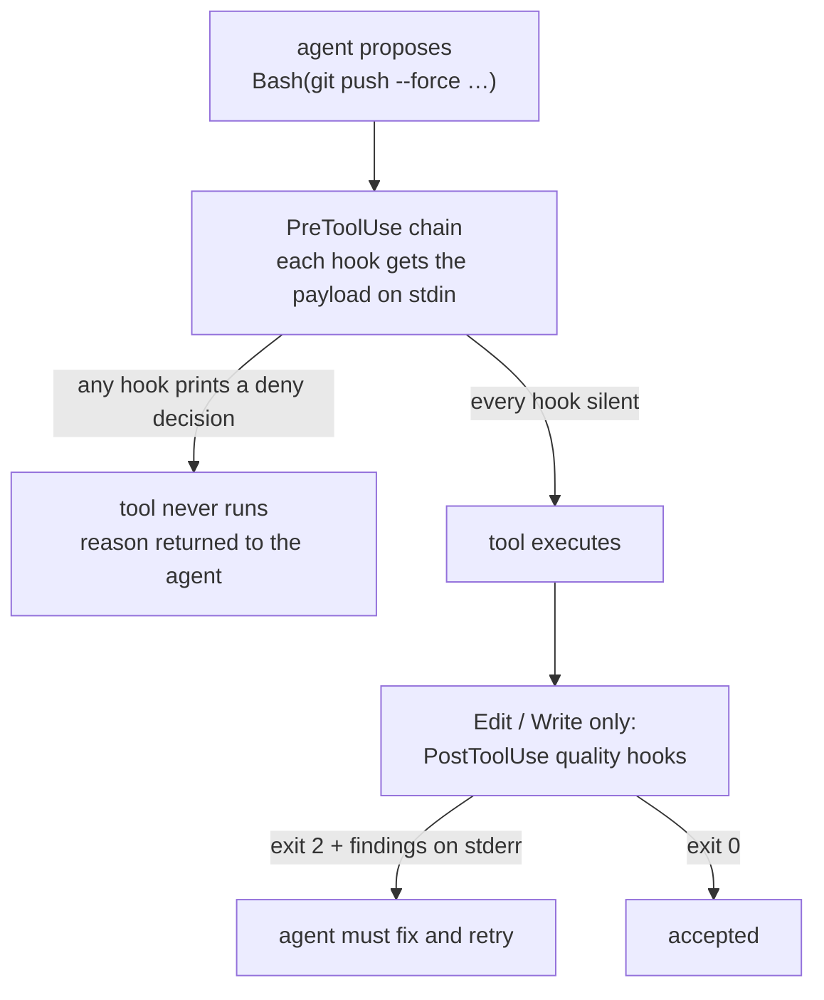

A police hook is a script the harness runs _before_ it executes a tool call, or _after_ it writes a
file. It gets the tool payload on stdin and it gets to say no.



## The deny contract, and why it differs by event

Two events, two incompatible contracts. Mixing them up silently disables a hook.

| Event         | To refuse                                        | To allow              |
| ------------- | ------------------------------------------------ | --------------------- |
| `PreToolUse`  | **exit 0** _and_ print a JSON decision on stdout | exit 0, print nothing |
| `PostToolUse` | **exit 2** with the findings on stderr           | exit 0                |

`PreToolUse` denial is carried by data, not by status. One JSON object holds both harnesses' deny
shapes at once, so a single script blocks in either:

```json
{
  "decision": "deny",
  "reason": "BLOCKED: 'bun install' — this project uses npm (package-lock.json). Use 'npm add'. Override (only when the user approves): prefix with AGENTKIT_ALLOW_PKG=1.",
  "hookSpecificOutput": {
    "hookEventName": "PreToolUse",
    "permissionDecision": "deny",
    "permissionDecisionReason": "BLOCKED: 'bun install' — this project uses npm (package-lock.json). Use 'npm add'. Override (only when the user approves): prefix with AGENTKIT_ALLOW_PKG=1."
  }
}
```

The top-level `{decision, reason}` pair is Grok's shape; `hookSpecificOutput` is Claude Code's. Both
are emitted every time by `agentkit_deny_json` in `hooks/claude/lib/hook-input.sh`.


The consequence is uncomfortable and load-bearing: **a `PreToolUse` hook that crashes emits no
decision, and no decision means allow.** A guard that dies on its first line is not merely broken;
it is silently off while appearing installed. That has happened in this kit — a hardcoded absolute
path that did not exist on one platform killed a hook immediately, and the harness reported only a
non-blocking status code. [Verify the install](/guide/start/verify/) is the routine that catches it.


### Why the write hooks exit 2

Claude Code discards a `PostToolUse` hook's stderr when it exits 0, so findings printed on a zero
exit reach nobody. `format-police`, `coding-police`, `comment-police` and `prose-police` therefore exit 2, blocking
the write, which is how their findings get in front of the agent. The OpenCode plugins take the other
route by design: they are advisory, appending findings to the tool output instead of throwing.

## What the payload looks like

The object on stdin is small. The fields the shared helper reads:

| Field                               | Read as                             | Notes                                                     |
| ----------------------------------- | ----------------------------------- | --------------------------------------------------------- |
| `tool_name` / `toolName`            | which tool is being called          | Grok names are mapped onto `Bash`/`Edit`/`Write` families |
| `tool_input.command`                | the shell command, for `Bash`       | the whole call is seen once, before anything runs         |
| `tool_input.file_path` and friends  | the target path, for `Edit`/`Write` | five spellings are accepted                               |
| `tool_input.new_string` / `content` | the text about to be written        | what `plan-police` judges                                 |
| `session_id` / `sessionId`          | the session                         | used for per-session state                                |


The payload carries no reliable working directory. Detection that needs a project — the lockfile
walk in `pkg-police`, for instance — starts at the **hook process's own** directory and stops at the
git root. Drive a hook by hand from inside the project you want it to judge.


## The wiring

The event decides what a unit can still prevent. A `PreToolUse` hook runs before the call and can
refuse it. A `PostToolUse` hook runs after the write has already happened; it reports, and the agent
is expected to fix what it reports.



That table is generated from `hooks/claude/settings.json`, which is the file the harness actually
reads.

`Edit` and `Write` are intercepted twice. Before the write, `plan-police` judges the content the edit
is about to land; after it, the quality hooks run on the result.

That split is deliberate rather than incidental. A `PostToolUse` hook can only object to a file that
already exists, which is the right shape for "this file is now too long" and the wrong shape for
"this edit is about to claim a plan is finished when it is not" — by then the claim is written. So
`plan-police` reconstructs the post-edit content itself and refuses beforehand, using the
`PreToolUse` deny contract rather than the exit-2 convention.

## The fail-closed supervisor

Because a crash reads as allow, the one hook whose whole purpose is refusal cannot be trusted to
speak for itself. `review-police` — both of its registrations — runs wrapped in `fail-closed-hook.sh`,
which:

- runs the real hook in a new session with a hard deadline;
- kills the whole process group on timeout, closing its own pipe ends first, because a descendant can
  start a new session and keep stdout open past the host deadline;
- emits a denial on a missing interpreter, a bad deadline argument, a spawn failure, a timeout, a
  non-zero exit, non-empty output that is not JSON, or JSON that is not a denial;
- passes empty output straight through, since that is the allow signal.

The child deadline is **45s inside the host's 60s**. Harness-side hook cancellation is non-blocking,
so the child has to time out _first_ and emit the denial itself — otherwise the host gives up on a
hook that never said anything, and the merge proceeds.

Every other police hook runs bare. Only the gate is supervised, because only the gate's silence is
worth a denial.

## Failing open, loudly

Several guards deliberately fail open, and they differ in how loudly:

| Unit              | When it cannot run                                  | What it does                                          |
| ----------------- | --------------------------------------------------- | ----------------------------------------------------- |
| `resource-police` | a parser dependency (`jq`, `awk`, `cat`) is missing | says so **once, loudly**, and allows                  |
| `mr-police`       | `glab` is unavailable or cannot identify you        | exits quietly — there is nothing to compare against   |
| `version-police`  | any registry error                                  | allows, with a short lookup timeout and a day's cache |
| `format-police`   | `dprint` or `dprint.json` is missing                | skips with a warning                                  |
| `review-police`   | anything at all                                     | **denies**                                            |

The rule is not "never fail open". It is **never fail silent**. A guard that cannot run and does not
say so is indistinguishable from a guard that approved.

## A refusal must redirect

Every police message names what to do instead: the worktree command to run, the `bounded-run`
invocation, the override variable for the legitimate exception.

```text
BLOCKED: 'npm install' is not allowed. Use bun instead. Mapping: npm install → bun install,
npm run → bun run, npm test → bun test, npm init → bun init, npx → bunx.
Override (only when the user approves npm): prefix with AGENTKIT_ALLOW_PKG=1.
```

Refusal, mapping, override. All three, every time. This is a design rule, not a courtesy — an agent
that hits a wall with no door will try every other wall. A refusal that does not say what to do
instead is treated as a bug in the kit.

What each unit refuses is in the [hooks reference](/reference/hooks/). How to override one for a
single command is in [override a guard](/cookbook/override-a-guard/).
