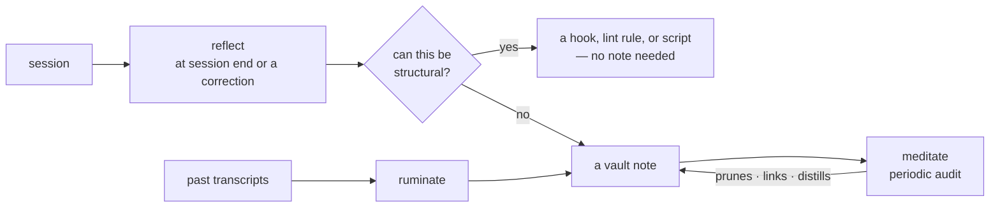

Police hooks enforce lessons someone already learned. The memory kit closes the other half of that
loop: capturing what a session taught, and deciding where it belongs.


Opt-in. `--with memory`, or `curl -fsSL https://raw.githubusercontent.com/developerinlondon/agentkit/main/kits/memory | bash`.


## The store is deliberately boring

`brain/` at the project root — an Obsidian-compatible tree of markdown notes with a `brain/index.md`
of bare `[[wikilinks]]`. Two small hooks do the plumbing:

| Hook | Event | Does |
| --- | --- | --- |
| `brain-inject.sh` | `SessionStart` (startup, resume) | prints the index so the agent knows what knowledge exists |
| `brain-index.sh` | `PostToolUse` (Edit, Write) | deterministically rebuilds the index after any write inside `brain/` |

Both are silent no-ops in projects without a vault, so the kit is safe to install globally.

## The loop

**reflect** runs at session end or after a correction. Its first question is never "which note?" but
"can this be a hook, lint rule, or script instead?" — a recurring lesson encoded structurally needs no
note at all. One-off knowledge becomes a vault note; skill-shaped lessons edit the skill.

**meditate** audits the vault against a hard quality bar: a note survives only if it is high-signal,
high-frequency, or high-impact. It prunes, proposes missing links, distills recurring patterns into
principles, and cross-checks skills against the vault.

**ruminate** mines past Claude Code conversations for what reflect never captured — good for
bootstrapping a vault from months of existing history.

## Why it is biased toward deletion

Every note costs context in **every** future session. A lean vault outperforms a comprehensive one,
which is why the loop routes to structure first and prunes hard second.

Two rules protect the vault's future:

- **No secrets in notes, ever** — a vault may later be shared or synced beyond one machine.
- **All skill or vault changes land as diffs a human reviews**, never as silent self-modification.

Deselecting the kit (`--without memory`) removes the managed skills, hooks, settings entries, prompts
and plugin. A later bare install keeps it absent until `--with memory` selects it again.

The vault layout and learning-loop design adapt
[brainmaxxing](https://github.com/poteto/brainmaxxing) (MIT) to agentkit's kit and enforcement model.
