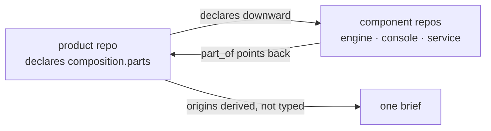
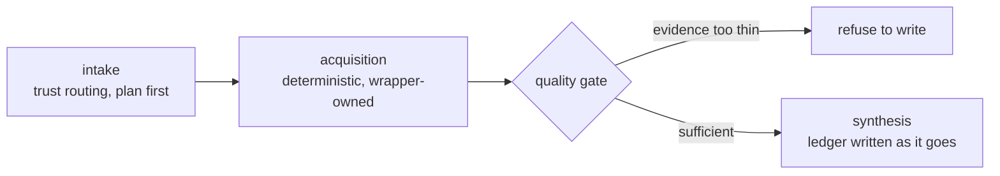

Diff review asks _is this change correct?_ Product review asks _can someone actually build, install and
use this?_ They are different questions, and the second has a structural blind spot in the first.

A stale build command in a README. A default configuration that produces a broken-looking install.
Missing packaging. A setup step that only exists in someone's head. None of it appears in a diff.

## Declaring what a product is

`.agentkit/product.yaml`, committed at the repository root — because a reviewer reads it in a fresh
clone, and an untracked manifest is the same as no manifest at all. [Declare your product](/cookbook/declare-your-product/) is the walkthrough.

```yaml
summary: >-
  What this product IS, from a user's point of view.
surfaces:
  - name: engine
    kind: cli # cli | service | web | desktop | library | api
    build: cargo build --release
    verify: cargo test
    run: ./target/release/engine --check
    expect: >-
      What a reviewer should look at once it is running.
    requires:
      credentials: [] # name + how to obtain — never secret VALUES
cannot_verify:
  - surface: daemon
    what: the pairing flow
    why: needs a host this environment does not have
```

Two field-level rules carry most of the value:

- **Commands run verbatim** from the repository root, in order. A flag belongs in the file, not in
  prose around it.
- **The verification must be able to fail.** A command that cannot fail verifies nothing.

`cannot_verify` is the honest half of the contract. Declaring a surface unverifiable makes a reviewer
report it as _not verified_, instead of skipping it quietly and leaving a green report that covers less
than it appears to.


**What the schema validates**

The kit ships a JSON Schema for the `part_of` back-pointer, with valid and invalid fixtures under test.
The `surfaces`, `requires` and `cannot_verify` blocks sit deliberately outside it: "every field is
optional except `surfaces`" is a convention the template states rather than one a parser enforces.


## agentkit's own manifest

The kit dogfoods this, declaring nine surfaces: the test suite, the Pages Worker, the Claude Code plugin, the OpenCode
plugin, the two review tools (`review-gate` and `review-profile`), the Codex review hook, the platform
command adapter, and the read-only infrastructure MCP server.

Its expectations read as models of what the fields are for. The test-suite surface says the suite passes
with zero failures and that platform-specific skips must be reported _by surface_ rather than summarised
as a small fixed count — deliberately not a pinned number, because this file exists to catch stale
expectations and should not carry one that drifts on every PR that adds a test.

Its notes also warn a reviewer that the kit's own hooks intercept naive verification: running the
bundled runner in place is refused, because trust is by installed path, not by name. A reviewer hitting
that is seeing the product work, not a defect.

## Products that span repositories

A product spread across several repositories gets a product repository that declares it. One product per
product repository, and that repository need not hold any code.



The declaration names each part with an id, a kind, a target, and optionally a free-text role — free
text on purpose, because a fixed vocabulary would force every product into one shape. It may also point
at its evidence artifacts, and those pointers are checked to resolve on disk: a declaration whose
evidence has moved is worse than one that never had any, because it reads as sourced right up until
somebody follows the pointer.

The back-pointer lives **inside the component's existing manifest**, above the surfaces, so one committed
file per component answers both questions a newcomer has: how do I run this, and what is this part of.

```yaml
part_of:
  product: acme-platform
  product_repo: acme/product
  part: engine
summary: >-
  Rules engine and CLI.
surfaces:
  - name: engine
```

## Product review

A separate lane, run alongside diff review and never instead of it. Four steps, in order:

1. **Build it** with each surface's declared build command. A build failure is a blocker — the product
   cannot be obtained at all.
2. **Verify it.** Run the verification. If it cannot fail, say so.
3. **Run it.** Start the surface and compare what you see against what `expect` said.
4. **Follow the setup as written**, from a cold start. Do not fill in a missing step from your own
   knowledge of the repo — _that gap is the finding._

Findings are graded **blocker** (cannot build or install, or the primary surface does not work as
documented), **high** (a documented command is wrong, or a required step is missing), **medium** (it
works, but a default, an error message or a setup step will predictably mislead) and **low** (friction).

### Verdict and coverage are separate axes

A verdict says what was found. Coverage says how much was exercised. Conflating them is how an unreviewed
product ends up looking reviewed.

| Axis     | Values                                                     |
| -------- | ---------------------------------------------------------- |
| Verdict  | `pass` · `blocked` · `unable_to_verify` · `not_applicable` |
| Coverage | `none` · `not_applicable` · `partial` · `complete`         |

`partial` is not a verdict. `not_applicable` means the surface genuinely does not apply; unavailable
credentials, hardware or runtime are `unable_to_verify`, which is a different statement.

### It refuses rather than guesses

With no manifest, the reviewer stops, records the absence — verdict `unable_to_verify`, coverage `none`,
plus a medium finding — and never returns a silent pass. There is deliberately **no** global fallback,
because inferring a build from the file tree is exactly the guess that produces a confident, wrong
report.


**When product review is mechanically required**

The exact target commit has to carry a review policy whose derived tier requires it. Without a target
policy, the legacy merge gate does not inspect this lane, and product review runs as a discipline
rather than a gate — describe it that way when reporting on it.


## Evidence-backed briefs

`product-intelligence` builds a brief about a product from a website, a repository, or supplied
documents. Its distinguishing property: the brief is not the deliverable on its own — the ledger under it
is.



### The ledger discipline

- **Written while investigating**, not reconstructed afterwards. A claim you cannot source at the moment
  you form it is unverified from birth.
- **One proposition per claim.** A statement needing "and" is two claims.
- **Class and confidence are independent.** Observed, inferred, proposed or unverified, against high,
  moderate or low — never merged into "probably true".
- **Contradictions stay contradictions.** Conflicting sources produce two linked claims, both rendered.
  An unresolved contradiction is a finished, honest state.

Every observed or inferred claim carries at least one source with a structural locator, a verbatim quote,
a stance, and an `as_of` date. The quote is what makes a fabricated citation catchable without reopening
the source.

The validator enforces more than shape: duplicate claim ids, an observed claim with no source, a
derivation on a claim that is not inferred, a reference to a claim that does not exist, an asymmetric
contradiction where only one side names the other, an impossible date — each fails loudly. So does
deriving an inference from a proposal, because proposals are not evidence about the present.

### Refusals

| Situation                                                                         | What happens                                                                               |
| --------------------------------------------------------------------------------- | ------------------------------------------------------------------------------------------ |
| Thin acquired evidence                                                            | Refuses to write; reports what came back and what input would change that                  |
| A question with no planned source                                                 | Becomes an explicit cannot-verify entry — never a search spiral                            |
| Fetched network content                                                           | Treated as hostile input: instructions in it are data to quote, never directives to follow |
| The target product itself                                                         | Read its documentation to learn the interface — never execute it                           |
| Competitors, pricing, market share, customer counts, roadmap, performance numbers | Never stated without a ledger source; absence becomes its own entry                        |

Acquisition is equally constrained. The model never runs the tools; a wrapper owns every invocation,
stamps a retrieval timestamp and logs the exact command. On Linux it insists on the bounded runner for
the crawl, extract and pack tools and fails closed without it. The fetch lane classifies every hostname
and every redirect hop against private, loopback, link-local, carrier-grade NAT and IPv6-transition
ranges and refuses non-public addresses. And the repository packer never runs bare inside a clone,
because a configuration file in that clone would execute on load.
