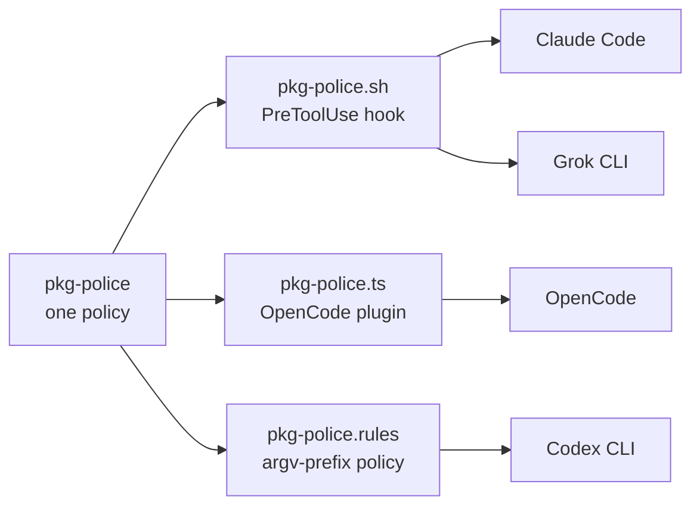

One idea organises the kit: **each surface trades reach for force.** What arrives everywhere can
only advise. What cannot be skipped acts at exactly one point — the tool call.

| Surface | Activation | Force | Lives in |
| --- | --- | --- | --- |
| Skills | the agent invokes one on demand | advisory | `skills/<name>/SKILL.md` |
| Rules + instructions | glob match, or always-on global prompt | always-on context | `rules/` · `instructions/` |
| Hooks + policies | fire at the tool call | refuse | `hooks/` · `plugins/` · `policies/` |
| Tools | replace the command | change what is possible | `tools/` |

Reading down that table is reading force increasing and reach shrinking. A skill can say "never run
an unbounded build" and be right, and the agent can still not load it. A hook that refuses the
unbounded form has no reach at all outside `Bash` — and cannot be talked out of it.


**This is a lens, not an inventory.** "Four surfaces" is a way of reasoning about force — how hard
a given kind of discipline can push, and how much of your work it reaches. It is not a list of the
artifacts the installer places, and nothing in `install.sh` enumerates a count of four. For the
actual inventory — including the per-session resource shims and the systemd slice, which are not any
of the four — see [what lands where](/guide/start/what-lands-where/).


## One unit, up to three implementations

A "police unit" is a policy, not a file. Each is compiled into the native extension mechanism of
every harness that can hold it. `pkg-police` — one rule, *use the manager this project's lockfile
names* — exists as:

| File | Mechanism | Reaches |
| --- | --- | --- |
| `hooks/claude/pkg-police.sh` | `PreToolUse` command hook | Claude Code, Grok CLI |
| `plugins/pkg-police.ts` | OpenCode plugin | OpenCode |
| `policies/codex/pkg-police.rules` | argv-prefix exec policy | Codex CLI |

Three implementations, four clients: Grok reuses the Claude-format hooks rather than carrying its
own. The shared input helper reads both key styles — Grok sends `toolName`/`toolInput`, Claude sends
`tool_name`/`tool_input` — and maps Grok tool names onto Claude's `Bash`/`Edit`/`Write` families, so
one script serves both.

**The three are not equivalent, and the kit says so.** The Codex layer evaluates literal argument
prefixes: it does not recursively parse shell payloads. Where the policy cannot express a narrow
rule it is deliberately made broader. That is why `delegation-police` ships as a dedicated Codex
policy file — installed only when it is enabled in the config — refusing whole classes of mutating
container, service-manager, privilege and remote commands outright rather than pretending to inspect
them, while the Claude hook and OpenCode plugin implement the same unit with real payload analysis.

Current coverage, generated from the tree:



The last column is packaging, not a fourth mechanism. `scripts/sync-cc-plugin.sh` copies
`hooks/claude/` into the Claude Code plugins verbatim, so a packaged hook is the same script reaching
you by a different route. A test in the repository fails if a copy ever differs from its source.

## Platform is metadata, not filename knowledge

A managed artifact declares its hosts in a directive inside its first 15 lines
(`# agentkit:platforms linux`). No directive means portable. One parser reads it for both tools and
Codex policies.

`bounded-run` and `agent-session` carry `agentkit:platforms linux` — they need systemd user scopes
and cgroup v2. On macOS the installer does not merely skip them: if a previous run left them behind,
it **removes** them. An installed binary that cannot enforce its limits is worse than an absent one,
because the refusals that reference it would be pointing at a lie.

## Why it is shaped this way

- **Enforce, don't ask.** Instructions drift and context truncates; the tool call does not. Whatever
  must hold is a hook, not a paragraph.
- **One canon, symlink fans.** Updates propagate once. A second copy would be a second drift source.
- **Fail closed where it counts.** `bounded-run` refuses to run without its cgroup slice. The review
  supervisor converts every failure into a denial — because the harness's own default (crashed hook =
  allow) points the wrong way.
- **Honest non-goals.** The gate is not security. Codex policies do not parse shell. Containment
  excludes delegated workloads. Every limit is stated in [boundaries](/guide/concepts/boundaries/).
