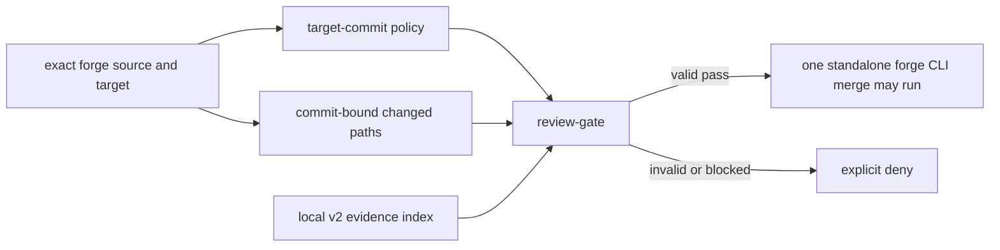

# Agent review process

`review-police` is a local merge-interception gate. In strict mode it validates
an evidence index for the exact forge change against policy read from the exact
protected target commit.

It is not an authentication boundary. The agent can write local JSON, so the
gate cannot prove reviewer identity, model-family independence, command
execution, redaction, or the truth of an evidence reference. Required forge
checks and approvals remain the authority that can prevent a determined bypass.



## Activation and bootstrap

The source checkout never selects the policy that judges itself.

- Target commit contains `.agentkit/review-policy.json`: strict v2 is mandatory.
- Target commit definitively lacks that path: the bounded legacy v1 adapter is
  used.
- Target commit or policy state cannot be read: deny. Unavailable is not absent.
- A change adding the first policy is reviewed under v1. That policy activates
  only after it lands on the protected target.
- An existing malformed, symlinked, or unsupported target policy denies; it
  never falls back to v1.

The policy itself is always classified critical when changed, even if a proposed
policy removes its own risk zone.

## Artifacts

| Artifact            | Path/location                                 | Durable?       |
| ------------------- | --------------------------------------------- | -------------- |
| Target-owned policy | `.agentkit/review-policy.json`                | committed      |
| Product contract    | `.agentkit/product.yaml`                      | committed      |
| Local review index  | `.agentkit/reviews/<source-branch-slug>.json` | no; gitignored |
| Evidence packet     | redacted PR/MR comment or controlled artifact | yes            |
| Local gate audit    | `~/.agentkit/review-audit.log`                | machine-local  |

The local record points at durable evidence; it is not the evidence archive.
Never commit it: committing changes the source SHA and immediately makes its own
binding stale.

Branch slugs replace `/` with `__`. Context fields inside v2 prevent a colliding
filename from authorising a different repository or change.

## Strict v2 record

```json
{
  "schema_version": 2,
  "context": {
    "forge": "github",
    "repository": "https://github.com/owner/repo",
    "repository_id": "github:github.com:R_example",
    "change_id": 123,
    "source_branch": "feat/example",
    "target_branch": "main",
    "source_sha": "<40-or-64-lower-hex>",
    "target_sha": "<40-or-64-lower-hex>",
    "policy_digest": "<target-policy Git blob OID>"
  },
  "risk": {
    "tier": "critical",
    "rationale": "Touches merge enforcement"
  },
  "lanes": {
    "diff": {
      "verdict": "pass",
      "summary": "Exact source-head diff survived falsification"
    },
    "product": {
      "verdict": "pass",
      "coverage": "partial",
      "summary": "Install and merge-denial paths were exercised"
    }
  },
  "findings": [],
  "claims": [
    {
      "lane": "diff",
      "claim": "Target policy cannot be weakened by the source",
      "status": "verified",
      "evidence": "target-policy integration test"
    }
  ],
  "checks": [
    {
      "id": "tests",
      "command": "scripts/product-command default -- bun test",
      "status": "pass",
      "exit_code": 0,
      "output_summary": "suite passed with no failures"
    }
  ],
  "analyses": [
    {
      "kind": "falsification",
      "status": "verified",
      "summary": "Source-policy substitution was attempted",
      "evidence": "integration test and trace"
    },
    {
      "kind": "artifact_lifetime",
      "status": "not_applicable",
      "reason": "No durable runtime artifact is introduced"
    }
  ],
  "evidence_ref": "https://forge.example/owner/repo/pull/123#evidence",
  "verdict": "pass"
}
```

Closed enums and exact JSON types are enforced. Findings require lane, severity,
summary, concrete scenario, and Boolean `resolved`. Claims are explicitly
`verified` with evidence or `unverified` with a reason. Checks must use an ID and
exact command from target policy. Analysis kinds are:

- `claims_audit`
- `falsification`
- `failure_trace`
- `analogy_differences`
- `pattern_sweep`
- `new_assumptions`
- `artifact_lifetime`

Required conditional analyses must be present even when they do not apply; use
`not_applicable` with a reason only where target policy allows it.
Critical policy must require at least one verified claim, so an empty claims
array cannot vacuously satisfy the claims audit.

## What the gate derives

1. Resolve current source/target branches and SHAs plus canonical repository URL
   and immutable forge repository ID.
2. Prove the target commit is locally readable, then read policy from that Git
   object—not the source worktree.
3. For strict mode, prove the source object is readable, compute the merge base,
   and enumerate `git diff --name-only -z --no-renames`. Disabling rename
   detection exposes both the deleted old path and added new path.
4. Compute the minimum tier from target policy and the complete path set. The
   recorded tier may ratchet upward, never downward.
5. Validate schema and exact context/policy bindings before considering consent.
6. Require the selected tier's product coverage, verified-claims minimum,
   checks, claims policy, analyses, and evidence reference.
7. Derive `pass` or `blocked` from lanes, findings, checks, claims, and analyses;
   reject a stored verdict that disagrees.

Critical records cannot use local consent. Valid blocked trivial/standard
records may use the existing explicit-consent claim only when target policy
allows it; the hook logs that path. Missing or malformed evidence is invalid and
cannot be consented away.

The evidence token can authorize only one literal, top-level `gh pr merge` or
`glab mr merge` invocation. The command must pass the resolved source SHA back
to the forge with GitHub's `--match-head-commit` or GitLab's `--sha`
precondition. That closes the check-to-merge race: if the branch advances after
the hook checks it, the forge refuses the merge. Current `glab` also requires
`--auto-merge=false`; otherwise a running pipeline makes the command queue a
deferred merge by default. For GitHub, the gate reads all active target-branch
rules and refuses a `merge_queue` rule: current `gh` implicitly enables
auto-merge or enqueues the pull request instead of completing the checked
invocation. Direct REST/GraphQL and MCP merges are refused, as are shell
wrappers, command substitutions, compound commands, multiple merge verbs, and
commands that could update the source before merging it. This is deliberately
fail-closed: a single PreToolUse decision cannot prove which head a later or
deferred command will land.

Claude command-hook cancellation is non-blocking, so both registrations invoke
`review-police` through `fail-closed-hook.sh`. The child has 45 seconds inside a
60-second host deadline. A child timeout, crash, or malformed non-empty output
becomes a valid deny response before Claude reaches its fail-open timeout.

## Reviewer workflow

Deterministic checks scale with the trusted target policy:

| Minimum tier | Required local check                                | CI behavior                                   |
| ------------ | --------------------------------------------------- | --------------------------------------------- |
| Standard     | `scripts/product-command default -- moon ci`         | affected Moon slices on Linux and macOS       |
| Critical     | `scripts/product-command default -- bun test`        | full suite inside both affected platform jobs |
| Main/nightly | n/a                                                 | full hosted Linux and macOS matrix             |

Moon derives affected tasks from explicit inputs. A separate routing check mechanically scans
every `tests/**/*.test.ts` file and fails if any test belongs to zero or multiple slices. Changes
to the routing, CI, enforcement hooks, or review governance are critical and therefore ratchet
back to the full suite.

Use the `adversarial-review` skill for plan and implementation refutation. Feed
it primary artifacts and a mechanically complete candidate set, not the
orchestrator's conclusion or another reviewer's verdict. It traces before
reading maker narrative and reports only findings backed by concrete failing
inputs or replayable traces.

For user-facing/installable changes, run `product-review` as a separate lane.
Product coverage and verdict are separate: `partial` describes how much was
exercised; it does not itself mean pass.

Post the redacted claims, checks, analyses, attempted falsifications, findings,
and remaining uncertainty to the PR/MR. The local record's `evidence_ref` points
there. Do not include secrets, tokens, or personal data.

## Legacy v1

Repositories whose exact target commit has no policy retain the old record:

```json
{
  "head_sha": "<exact source head reviewed>",
  "verdict": "pass",
  "findings": []
}
```

This compatibility path checks source SHA, unresolved HIGH/BLOCKER findings,
verdict, and the historical written-consent shape. It exists only to bootstrap
strict policy.

## Known limits

- `source_sha` is the exact reviewed source head, not a generated squash/merge
  commit. Integrated-result assurance requires a protected merge-ref/merge-queue
  CI check.
- The enforced `--match-head-commit` / `--sha` condition closes the source-head
  race. Neither CLI exposes an equivalent target-head compare-and-swap: the
  target branch can advance between local validation and merge. Protected
  merge-ref/merge-queue CI and branch rules must revalidate that integrated
  result; the local hook cannot certify it atomically.
- The supervisor closes bounded child failures, not cancellation of the
  supervisor process itself. Local hooks remain defense in depth; protected
  forge checks and approvals are the enforcement boundary.
- Claude Code, Grok, and current Codex installations invoke this hook. Codex
  treats changed non-managed hook definitions as untrusted until the user
  reviews them with `/hooks`. OpenCode runtime registration remains separate.
- Same-family reviewers can share blind spots. Critical work still needs
  deterministic checks and an external human or different-family review at the
  forge boundary.
