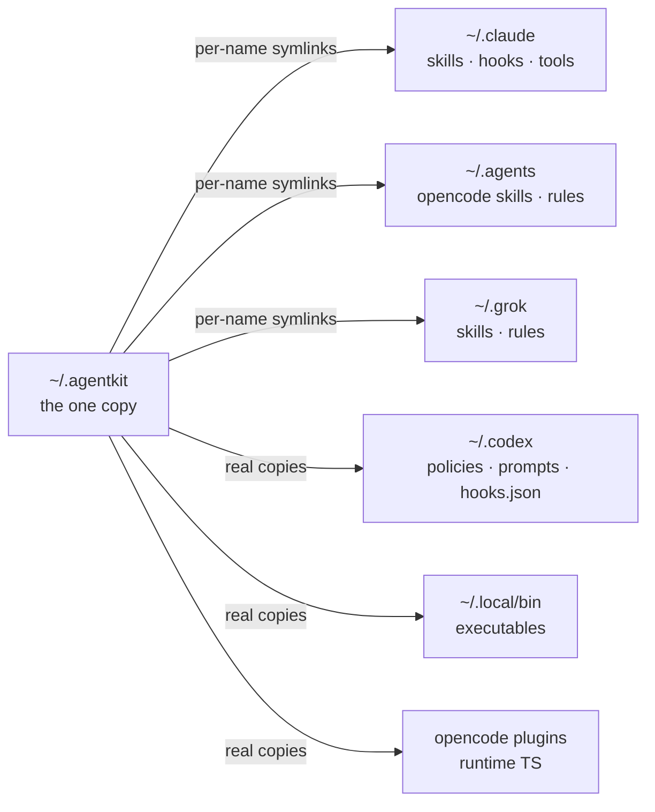

One idea organises the kit: **each surface trades reach for force**. What arrives everywhere can
only advise. What cannot be skipped acts at exactly one point — the tool call.

## The four surfaces

| Surface              | Activation                             | Force                   | Lives in                            |
| -------------------- | -------------------------------------- | ----------------------- | ----------------------------------- |
| Skills               | the agent invokes one on demand        | advisory                | `skills/<name>/SKILL.md`            |
| Rules + instructions | glob match, or always-on global prompt | always-on context       | `rules/` · `instructions/`          |
| Hooks + policies     | fire at the tool call                  | refuse                  | `hooks/` · `plugins/` · `policies/` |
| Tools                | replace the command                    | change what is possible | `tools/`                            |

Reading down that table is reading force increasing and reach shrinking. A skill can say
"never run an unbounded build" and be right, and the agent can still not load it. A hook that
refuses the unbounded form has no reach at all outside `Bash` — and cannot be talked out of it.

:::caution[Two different fours]
There are four _surfaces_ (above) and four _clients_ (below). They are unrelated counts. Earlier
versions of this documentation conflated them.
:::

## The four clients

`install.sh` targets four harnesses: **OpenCode**, **Claude Code**, **Codex CLI**, and
**Grok CLI**. They do not get four copies of the discipline — they get four bindings to one.

## One unit, up to three implementations

A "police unit" is a policy, not a file. Each is compiled into the native extension mechanism of
every harness that can hold it. `pkg-police` — one rule, _bun, never npm/yarn/pnpm_ — exists as:

| File                              | Mechanism                 | Reaches               |
| --------------------------------- | ------------------------- | --------------------- |
| `hooks/claude/pkg-police.sh`      | `PreToolUse` command hook | Claude Code, Grok CLI |
| `plugins/pkg-police.ts`           | OpenCode plugin           | OpenCode              |
| `policies/codex/pkg-police.rules` | argv-prefix exec policy   | Codex CLI             |

Three implementations, four clients: Grok reuses the Claude-format hooks rather than carrying its
own. The shared input helper reads both key styles — Grok sends `toolName`/`toolInput`, Claude
sends `tool_name`/`tool_input` — and maps Grok tool names onto Claude's `Bash`/`Edit`/`Write`
families, so one script serves both.

**The three are not equivalent, and the kit says so.** The Codex layer evaluates literal argument
prefixes: it does not recursively parse shell payloads. Where the policy cannot express a narrow
rule it is deliberately made broader. That weakness is why `delegation-police` exists on Codex and
nowhere else — it refuses whole classes of mutating container, service-manager, privilege and
remote commands outright rather than pretending to inspect them.

## Install topology: one tree, symlink fans

Portable content lands once under `~/.agentkit/{skills,rules,instructions,hooks,tools}`. Each
client receives per-_name_ symlinks into that root — never a second full tree — so skills you
installed from somewhere else survive every upgrade.

Three targets take real copies because symlinks cannot work there: the OpenCode plugin directory,
`~/.local/bin` (it must be on `PATH` as files), and the Codex tree. Claude Code's hooks section is
merged into `settings.json` idempotently — the whole `hooks` block is replaced from the canonical
`hooks/claude/settings.json`, so an upgrade both adds new entries and strips withdrawn ones.

There is a second Claude Code mode. `--global --claude-plugin` installs the Claude bits as
marketplace plugins instead of copying hooks and merging settings. The two modes are mutually
exclusive by design: plugin `hooks.json` layered on top of `settings.json` hooks would fire every
hook twice.

## Platform is metadata, not filename knowledge

A managed artifact declares its hosts in a directive inside its first 15 lines
(`# agentkit:platforms linux`). No directive means portable. One parser reads it for both tools and
Codex policies.

`bounded-run` and `agent-session` carry `agentkit:platforms linux` — they need systemd user scopes
and cgroup v2. On macOS the installer does not merely skip them: if a previous run left them
behind, it **removes** them. An installed binary that cannot enforce its limits is worse than an
absent one, because the refusals that reference it would be pointing at a lie.

## Why it is shaped this way

- **Enforce, don't ask.** Instructions drift and context truncates; the tool boundary does not.
  Whatever must hold is a hook, not a paragraph.
- **One canon, symlink fans.** Updates propagate once. A second copy would be a second drift
  source.
- **Fail closed where it counts.** `bounded-run` refuses to run without its cgroup slice. The
  review supervisor converts every failure into a denial — because the harness's own default
  (crashed hook = allow) points the wrong way.
- **Honest non-goals.** The gate is not security. Codex policies do not parse shell. Containment
  excludes delegated workloads. Each limit is documented where the feature is.
