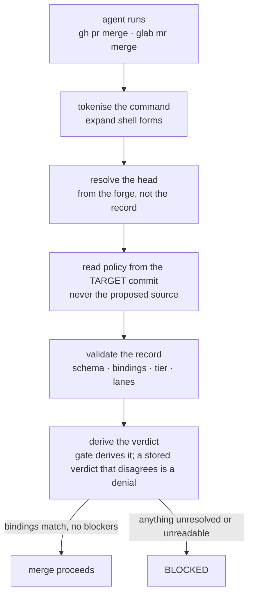

Two different things share the word "review", and confusing them is the most common way to
mis-describe this kit.

|             | Review discipline                          | The merge gate                             |
| ----------- | ------------------------------------------ | ------------------------------------------ |
| Ships as    | `review-discipline.md`, a core instruction | `strict-review` skill group                |
| Installed   | always                                     | only on `--with strict-review`             |
| Enforcement | none — advisory                            | `review-police` refuses the merge command  |
| Requires    | a reviewer that did not author the change  | a validated record bound to the exact head |

:::caution[Review is not on by default]
The gate is the `strict-review` group, marked `explicit` in the manifest. It is not in `--all`, it is
never offered by the interactive picker, and only a literal `--with strict-review` (or its `--with
review` alias) installs it. When it is not selected, the installer **removes** its hooks, its tools,
its skill, its instruction file, and its entries in `settings.json` and Codex's `hooks.json`.

Absent that group, one advisory reviewer pass per substantive change is the discipline, and nothing
mechanically blocks a merge.
:::

## The discipline

The maker never grades its own work. Before merging substantive work, one advisory review pass runs
in a context that did not author the change — a reviewer subagent where the harness supports one, a
fresh session otherwise.

Three details in it do most of the work:

- **Review the committed state**, via `git show` or `git diff <base>...HEAD` — never the working
  tree. A shared checkout can hold abandoned edits that were never proposed.
- **Probe, don't read.** Run the tests, execute the change, try to break it. Where the change adds a
  test or a guard, mutate what it claims to cover and confirm it fails; an assertion that cannot fail
  is not evidence.
- **Findings come back ranked, with a concrete failure scenario each**, and the author fixes them
  rather than arguing them down. After fixes, a delta re-review — full re-reviews are for new scope.

Trivial changes are exempt: typos, labels, comment wording, config value tweaks.

## The gate

With `strict-review` installed, a merge is refused unless a review record exists that is bound to
the **exact source head the forge is about to merge**.

Two properties of that flow are the whole design:

**The change never chooses its own judge.** Policy is read from the exact target commit. A branch
cannot weaken the rules that judge it. If the target commit or its policy state cannot be read, the
answer is deny — _unavailable is not absent_. A change that _adds_ the first policy is reviewed under
the bounded legacy shape, and the policy activates only once it has landed on the protected target.

**Disagreement is a denial.** The gate derives the verdict itself from the record's contents and
rejects a stored verdict that contradicts it.

### What the record has to carry

The record is validated field by field. Its `context` object must equal the values the gate derives
— exactly, with no missing keys and no extra ones: forge, repository, immutable repository id, change
id, source and target branches, source and target SHAs, and a digest of the target policy. On top of
that:

| Block          | Contents                                                                                                                               |
| -------------- | -------------------------------------------------------------------------------------------------------------------------------------- |
| `lanes`        | A diff lane and a product lane, each with a verdict; the product lane also carries coverage                                            |
| `findings`     | Lane, severity, summary, scenario, resolved — any unresolved blocker or high finding derives a blocked verdict                         |
| `claims`       | Each verified with evidence, or unverified with a reason; a tier may forbid unverified claims entirely                                 |
| `checks`       | Command plus outcome: passed at exit zero, failed with the code and reason, or **not run** with a reason                               |
| `analyses`     | Seven closed kinds: claims audit, falsification, failure trace, analogy differences, pattern sweep, new assumptions, artifact lifetime |
| `user_consent` | An explicit local override carrying a non-blank user quote and a timestamp — a _passing_ record must not carry one                     |

The `checks` block having three outcomes rather than two is deliberate. A check that shells out to an
external tool can run and pass, run and fail, or **never run** — and the third is the dangerous one,
because a skip reads like a pass in a column of green.

### Where the artifacts live

| Artifact            | Location                                              | Durable         |
| ------------------- | ----------------------------------------------------- | --------------- |
| Target-owned policy | `.agentkit/review-policy.json`                        | committed       |
| Product contract    | `.agentkit/product.yaml`                              | committed       |
| Local review index  | `.agentkit/reviews/<source-branch-slug>.json`         | no — gitignored |
| Evidence packet     | a redacted PR or MR comment, or a controlled artifact | yes             |
| Local gate audit    | `~/.agentkit/review-audit.log`                        | machine-local   |

The review record must never be committed: committing it changes the source SHA and immediately makes
its own binding stale.

### What the merge command itself must look like

The hook is as strict about the command as about the record, because a command it cannot parse is a
command it cannot bind. It refuses tool-based merge integrations outright, direct REST and GraphQL
merges (which cannot be bound to a reviewed repository context), and merge-when-pipeline-succeeds
push options. What it accepts is narrow: one standalone merge command carrying a head precondition
that matches the forge-resolved head, with no auto-merge, no shell operators, no globs and no
substitutions.

It over-blocks on purpose. A compound command that merely mentions a merge is refused — a false
denial is an inconvenience, and a missed merge is the failure the gate exists to prevent.

## Profiles decide effort, not authority

`review-profile` resolves how much review a change needs. Three presets: `fast` (primary review for
non-trivial work), `balanced` (the default — one primary review, with specialist and product lanes
risk-triggered), and `strict` (all lanes, full local checks, a fresh CI run).

The resolver is orchestration guidance. It **cannot** lower what the exact target commit's policy
requires, and target-owned policy can demand checks, product coverage, analyses or evidence that a
local profile omits. The same asymmetry applies to the config file: a repository's
`.agentkit/review-policy.json` can require stricter evidence and cannot be weakened by
`~/.config/agentkit/config.yaml`.

## Honest limits

:::caution[The gate is not a security boundary]
The review record lives in the repository and the agent can write it. The gate therefore cannot prove
reviewer identity, model-family independence, that any command actually ran, that evidence was
redacted, or that a referenced evidence link says what the record claims. A determined agent can
forge a pass.

What it does is make the honest path correct and a stale review mechanically impossible to merge past
by accident. **Only forge-side required approvals actually prevent a merge.**
:::

That limit is restated in the process doc, the gate validator, the hook itself, the
`evidence-gated-review` instruction, the README, and both review skills — specifically so nobody has
to go looking for it.
