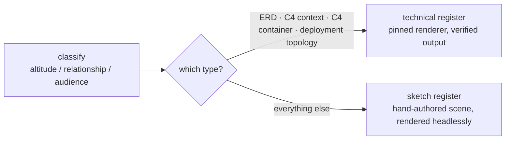

Generic boxes-and-arrows is what comes out when nobody decided what kind of diagram this is. The answer
is to make classification the first step and the render mechanical — and, where the project already
holds the graph, never to author it by hand at all.

## Classify first

Before any drawing, write one line:

```
altitude / relationship / audience → type
```

- **Altitude** is how far up you are standing: business capability, system context, container,
  component, or code and data. One altitude per figure. A component sitting next to an external system
  is a misclassified diagram, not a detailed one.
- **Relationship** is what the edges mean — six values: structural, behavioral, data, deployment,
  comparison, quantitative.
- **Audience** picks no column. It caps the altitude and sets the depth, and when the cap and the
  question conflict, the cap wins.

Crossing altitude against relationship gives a grid of named types — C4 context, sequence, state
machine, ERD, deployment topology, funnel, and so on. A trigger table maps prompt phrases and repository
signals onto cells, and three tie-breaks settle the overlaps: a runtime substrate means deployment
topology; a schema artifact means an ERD; otherwise the question being answered decides.

One disambiguation is worth quoting, because it is the mistake people actually make: chart directories
and compose files are **inventories of deployables, not substrate**, so they select the container view
unless the prompt also says where it runs.

## Two registers



The type picks the register; it is not a stylistic preference. The technical register carries exactly
**four** types today. Everything else is drawn in the sketch register. C4 component is the one row that
sits in both — the register follows the recipe, not the type.

### The sketch register

Hand-authored Excalidraw scene JSON, rendered headlessly to a self-contained vector image. It exists for
the diagrams whose value is the metaphor: a mental model, a protocol, a comparison, a failure story.

Four authoring rules shape the output more than any style choice:

- **Boxes are earned.** Map each concept to a structural pattern — fan-out, merge, tree, timeline, cycle,
  pipeline, mirrored halves, zones, overlap. The pattern table is a floor, not a ceiling.
- **Section by section.** Never generate the whole file in one pass; a comprehensive scene exceeds a
  single response's output budget and truncates.
- **Three zoom levels, for large diagrams.** An overview strip, labelled zones, then teaching detail. Trace the eye-path
  before writing any JSON.
- **Render, look, fix.** A mandatory visual loop. Stop when it could not be composed better, not when
  nothing is broken.

Two tests decide whether a figure earned its shape: strip the labels — does the structure still say it?
And would a newcomer _learn_ the mechanism from the picture alone?

### Density is a number, not a taste

> at most 3 zones, ~12 labeled nodes, ~25 text elements per diagram. Exceeding any of the three means
> split, don't shrink — one argument per figure; a fourth zone is a second figure with its own caption.

Colour is constrained the same way: the error colour is a stroke colour and never a text colour,
decoration never shares the hue of the text it decorates, and two adjacent semantic colours require a
legend inside the zone.

### The technical register

A declarative diagram language run through a wrapper that refuses anything it cannot reproduce.

The renderer is pinned to a single version — **D2 v0.7.1** — defined once as `D2_PIN` in the skill's own
source and mirrored into its docs and the CI workflow. The wrapper shells the binary, compares the
version, and refuses any other build: a render is only reproducible on the build it was authored against.
An absent binary fails with the pin and the release URL in the message.

:::note[Nothing in the installer places that binary]
A user installs D2 from the release the error names. In CI the same pin is installed by a composite
action that verifies the download against a recorded checksum per platform, then re-checks the resulting
version. A platform with no recorded checksum is a hard failure by design rather than an unverified
download — which does mean the verified path covers two platforms today.
:::

What the wrapper refuses:

| Refusal                                                        | Why                                                                         |
| -------------------------------------------------------------- | --------------------------------------------------------------------------- |
| A renderer absent, or at another version                       | Renders would not be reproducible                                           |
| Any `href` not inlined as a `data:` URI — remote or filesystem | A published page must make no network request, and the SVG must stand alone |
| Embedded `<script>` or `<foreignObject>` elements              | Use a text shape for titles instead                                         |
| Fewer embedded icons than the source referenced                | An icon silently failing to inline is a broken figure that still renders    |
| An unknown icon name                                           | Fails loudly, with a suggestion when it looks like a misspelling            |

Post-processing is deterministic. The dark-mode media query — which the renderer emits as
`prefers-color-scheme` — is rewritten to key off the page's `data-theme` attribute instead, so a
figure follows the theme toggle rather than the operating system. The renderer's own full-bleed
backdrop rect is **removed** rather than overridden, because the figure island supplies the surface.
Fixed `width` and `height` are stripped for `width="100%"` and `height:auto`, and the root gains
`role="img"` with an `aria-label`.

The output also carries a `d2` class, which is what the page theme keys its light-mode inversion
exemption off — and the reason that exemption exists is legal, not visual. Inverting would recolour
every embedded vendor logo, which the trademark rule forbids.

## Icon packs, split by what may be redistributed

| Tier    | Committed | What it is                                                                                       |
| ------- | --------- | ------------------------------------------------------------------------------------------------ |
| Bundled | yes       | Two CC0 icon sets trimmed to a selection, each carrying its upstream pin, author and licence URL |
| Vendor  | **never** | Pinned by URL and sha256 in a registry file; fetched onto the machine that will use it           |

Where a name exists in both bundled sets, the full-colour set wins.

The vendor tier is not one licence. Of the two packs, Azure's terms **expressly grant** permission for
architectural diagrams; Google publishes its set with **no licence granted at all**. The fetch prints the
vendor's terms and refuses to download until `--accept-terms` is passed, and each installed tree is
stamped with a `NOTICE` reproducing the terms it arrived under. A test fails if the quoted terms drift
from the machine-readable registry.

**No install step runs the fetch.** Fetching is always a deliberate act; `install.sh` does not mention
vendor packs. Referencing an unfetched pack fails the render and names the exact command to fix it.

The fetch is hardened well past a checksum: a mismatch aborts naming pinned versus received, an insecure
URL is refused before any request _and_ re-checked on the final URL once redirects resolve, archive and
unpacked size and entry count are all capped, a link entry or one escaping its root disqualifies the whole
archive, per-icon screening treats scripts and inline handlers as fatal, and the install is staged then
swapped in whole — a half-written tree would resolve some icons and not others.

:::note[AWS is absent, for a stated reason]
Its icon archive URL embeds both a release date and a content hash that cannot be derived, and superseded
URLs stop resolving — so a pin would break every quarter, and scraping the current URL would defeat the
point of pinning. The bundled CC0 set already carries the common AWS marks, so what is missing is the full
stencil library, not its iconography.
:::

The trademark rule is absolute: vendor logos are never recoloured, distorted or theme-filtered, and are
reproduced unmodified for nominative identification only. A near-black mark that disappears on a dark
ground gets a light plate behind it, never a recolour.

## Extractors: read the graph, don't remember it

For four notations the project already holds the truth, so the graph is read out of it.

| Kind     | Reads                        | Produces            | Scope levers                              |
| -------- | ---------------------------- | ------------------- | ----------------------------------------- |
| `deps`   | a dependency-graph report    | C4 component view   | `--focus`, `--group-depth`, `--externals` |
| `schema` | a schema dump                | crow's-foot ERD     | `--tables`                                |
| `infra`  | applied infrastructure state | deployment topology | `--group-by type`, `--no-reduce`          |
| `k8s`    | manifests or a live query    | deployment topology | `--namespace`, `--config`                 |

The extractor never runs the upstream tool for you, and none of them is bundled. It reads a file or
stdin, writes a file or stdout, and that is the whole interface.

> Your job is choosing the scope — which subtree, which schema, which namespace — never authoring the
> graph. … The difference is not effort, it is truth. A hand-authored ERD records what you remembered
> about the schema; a derived one records the schema.

The boundary of the lane is equally explicit. C4 context and C4 container are claims about what a system
is _for_ and where its responsibility ends, which no tool reads off a repository — a container inventory
scraped from a chart directory would be a deployables list wearing a C4 costume. Those you author.

### What "deterministic" buys

- **It refuses to guess.** An unstated relationship cardinality draws no marker and no label rather than a
  plausible one; one the source states but the extractor does not recognise fails the extraction outright.
  A service name that merely appears inside a longer word does not become an edge.
- **It refuses to leak.** The infrastructure extractor reads only structural fields. No resource attribute
  value is ever read — that state embeds provider secrets in plain text, and a diagram derived from it must
  not become a way to publish them.
- **It refuses a hairball.** Past the node budget it stops and names the lever that would narrow the
  scope, and fails the opposite way too when a grouping collapses everything into one box.
- **It refuses ambiguity.** Duplicate ids are rejected rather than merged, because the renderer merges
  same-key blocks silently and the figure would come out confidently mislabelled.

Because the input is somebody else's data — a column type, a mount path, an image name — the emitter has a
single quoting sink handling escapes, substitution syntax, newlines and control characters, with
keyword-shaped fields constrained by pattern and a reserved-word list that slugging pushes clear of. The
provenance comment records what produced the figure but deliberately records **no input path**, so a
render cannot depend on where the checkout sits.

## What is not there yet

:::caution[The sketch register has no test coverage]
Every test in the diagram suite exercises the technical path — the D2 wrapper, the icon resolution, the
extractors, the committed examples. Nothing on disk asserts anything about the headless scene renderer.
Its self-containment rests on upstream export behaviour.
:::

The technical register is held to its claims by test: the same input renders byte-identically twice,
committed examples byte-match a fresh render, hostile column types and mount paths compile through the
real renderer, and the kit's own module graph is asserted to come out as a figure rather than a hairball.
Those tests are conditional on the pinned renderer and the dependency-graph tool being present, and skip
loudly when either is missing. That asymmetry is the honest summary of where this skill is mature and
where it is not.
