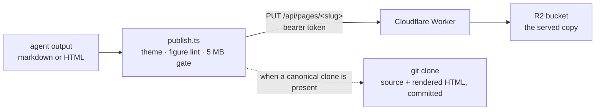

An agent finishes something worth looking at — a report, an architecture page, a deck — and chat is
the wrong container for it. Pages is the other end: one command renders that content through a house
theme and returns a live URL.

:::caution[Published pages are public]
Reads are unauthenticated, so anyone with the URL can load the page. A `noindex, nofollow` robots
header keeps an unlinked slug out of search results, and an unguessable slug is not access
control. Publish nothing confidential.
:::

## The serving path



Three parts in the serving path — a skill that renders and uploads, a Worker that serves, an object
store that holds the rendered HTML — plus an optional canonical clone.

### The Worker contract

| Method        | Path                       | Behaviour                                                                                                           |
| ------------- | -------------------------- | ------------------------------------------------------------------------------------------------------------------- |
| `PUT`         | `/api/pages/<slug>`        | 401 on a bad bearer · 400 on a bad slug · 413 over 5 MB or on an empty body · else store and return the URL as JSON |
| `DELETE`      | `/api/pages/<slug>`        | 401 · 400 · 404 when the key is absent · else delete                                                                |
| `PUT`         | `/api/site/<path>`         | site-token only · the docs-asset keyspace, real filenames and extensions · same 5 MB rule                           |
| `DELETE`      | `/api/site/<path>`         | site-token only · 400 on a path outside the docs subtree · 404 when absent                                          |
| `GET`, `HEAD` | apex (and `www`) `/<path>` | the site keyspace; the root is the site index                                                                       |
| `GET`, `HEAD` | pages host `/<slug>`       | the published-pages keyspace with `noindex, nofollow`; the root is the pages index                                  |
| anything else | —                          | 405                                                                                                                 |

Reads split on host. Writes split on keyspace. Auth is checked **before** the slug or path is
validated, so an unauthenticated caller learns nothing from a 400.

:::note[The docs subtree is a deliberate relaxation]
This documentation is served from the site keyspace under a `docs/` prefix, and that subtree is the
one place the Worker accepts real filenames with extensions, dotted path segments (a version
directory like `docs/0.4`), deeper nesting, and a looser CSP that permits `'self'` scripts and
`wasm-unsafe-eval` — a generated site addresses hashed bundles and its search index needs WebAssembly.
Every one of those relaxations is confined to that prefix. Outside it the apex still answers only
`<slug>/index.html` under `default-src 'none'`.
:::

## Three secrets, three jobs

| Secret        | Grants                                             | Consequence                                 |
| ------------- | -------------------------------------------------- | ------------------------------------------- |
| slug key      | derives a URL from a name — no write access at all | rotating the auth tokens never moves a page |
| publish token | writes `pages/<slug>/…`                            | a leak defaces pages, not the site          |
| site token    | writes `_site/…` only                              | the site's own keys need a different secret |

The separation between the two write tokens is **mechanical, not policy**: every site key is rooted at
`_site/`, and the published-page slug alphabet has no way to express a leading underscore. A
publish-token holder cannot address a site key at all.

Slugs are an HMAC-SHA256 of the name under the slug key, truncated to 20 hex characters. Deterministic,
so republishing the same name updates the same URL, and no name-to-slug mapping has to be stored
anywhere. The key is generated on first use under `~/.config/agentkit/pages-slug-key` — and because it
determines the URL, the _same_ key must be copied to other machines or the same name derives a
different URL per machine. The run says so when it generates one.

`--slug` overrides that with a readable path. Use it only when a person has to read, type or say the
URL aloud.

## Publishing

```
bun <skill-dir>/publish.ts --name <name> --file <content-file> \
  [--template doc|deck|raw] [--title "Title"]
bun <skill-dir>/publish.ts --name <name> --delete
```

| Flag               | Meaning                                                                                            |
| ------------------ | -------------------------------------------------------------------------------------------------- |
| `--name`           | The logical name; the slug is derived from it                                                      |
| `--slug`           | A readable path instead of a derived slug                                                          |
| `--file`           | The content — markdown for docs and decks, self-contained HTML for bespoke pages                   |
| `--template`       | `doc` (default), `deck`, or `raw` (published as-is)                                                |
| `--title`          | Overrides the title, which otherwise comes from the first heading, a `<title>`, or the page's name |
| `--delete`         | Remove a page you published                                                                        |
| `--no-git`         | Skip the canonical commit                                                                          |
| `--allow-bare-svg` | Suppress the bare-diagram refusal — blocked by a hook unless the user approved it                  |

The skill publishes end to end without asking about slug, template or mechanics — [publish a page](/docs/cookbook/publish-a-page/) walks one through. The one carve-out is
content: when it is _proposing_ the page and the material is private, it confirms first. And it does not
skip verification — load the printed URL in headless Chromium, screenshot both themes, read every
figure. **Never report the URL of an unviewed page.**

## Direct writes are blocked on purpose

[`pages-police`](/docs/reference/hooks/) refuses raw `curl`, `wget`, `httpie` and `xh` writes to the
publish API. Publishing
through the skill enforces the figure lint, the size cap and the canonical commit; a raw write bypasses
all three.

The hook matches command shapes, so it covers the convenient wrong path — the one an agent actually
takes — rather than every possible route to the API.

## Self-containment is enforced, not advised

A published page makes no external request of any kind. The serving headers set `default-src 'none'`
with inline-only styles and scripts, images and fonts only as `data:` URIs, and framing and form
submission blocked outright.

That is the environment, not a recommendation to authors: a page referencing a CDN simply does not load
that resource. So every page inlines everything — styles, scripts, fonts, images, and the diagram
runtime when a figure needs it.

The ceiling is 5 MB, checked twice on the way in (once against the declared length, once against the
actual bytes) and again client-side, with an empty body rejected too. The client-side check names the
tradeoff when a page is over: the inlined mermaid runtime alone accounts for roughly 3.4 MB, leaving a
diagram page about 1.4 MB for content, so a diagram-heavy page either splits or drops diagrams.

## The figure lint

One rule is enforced at publish time rather than left to taste. A baked diagram published outside a
figure island — or outside a container whose background uses the theme's diagram token — is refused.

The failure it prevents is specific: a dark-palette diagram dropped onto a page-supplied white
background is illegible in _both_ themes. There is a warning for the near miss too, when a page's own
styles hardcode white while carrying a baked diagram.

## The canonical clone

When a clone of the canonical pages repository is present, publishing also writes the unrendered source
and its metadata, the rendered HTML, and a commit **scoped by path** to exactly those files, pushed
immediately. A failed push warns that the commit is local only.

```
themes/          versioned page chrome
src/<slug>/      page source: content + metadata
dist/<slug>/     rendered HTML — the archived copy of what was uploaded
```

The path scoping is deliberate: the clone is long-lived and shared, and a bare commit would sweep in
anything else that happened to be staged.

Without that clone, publishing still works — it warns once that it is using the skill's bundled themes,
which can lag the canonical ones, and that no history is being recorded. That warning matters: a
republish under an existing name overwrites silently, and on a machine with no clone there is nothing
to recover from.

Staleness runs both ways, and the clone is the side that is easiest to miss. Publishing prefers the
clone's themes whenever a clone exists, so a clone left behind its upstream serves older chrome than
the installed skill carries — while the renderer, which ships with the skill, stays current. The two
disagree inside a single page, and nothing fails: the upload succeeds and the page loads. A drift
warning does fire, but it names the bundled copy as the stale one either way, so in this direction
its advice is backwards. Pull the clone before publishing after an upgrade.
