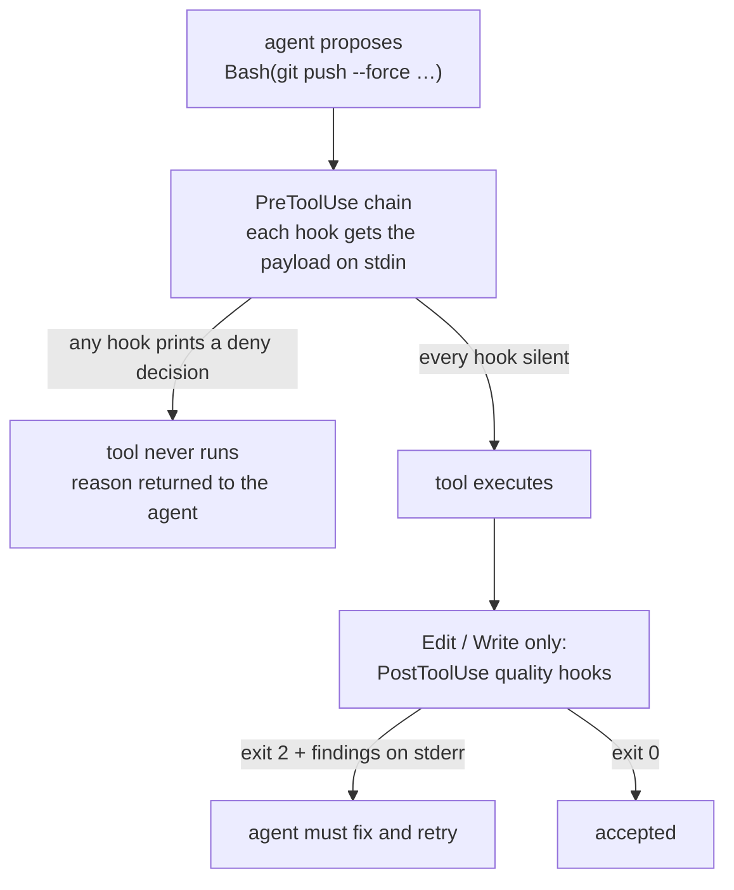

A police hook is a script the harness runs _before_ it executes a tool call, or _after_ it writes a
file. It gets the tool payload on stdin and it gets to say no.

:::caution[Guards, not boundaries]
None of this is a sandbox. A police hook detects and refuses; it does not isolate, contain, or
constrain hostile code. A script that speaks HTTP directly, or delegates work into a container, is
outside what any of these hooks can see. Treat them as defence-in-depth detection against the
convenient wrong path — which is the path an agent actually takes.
:::

## The interception path

The `PreToolUse` chain on `Bash` runs in a fixed order, each with its own timeout: `git-police`,
`kubectl-police`, `pkg-police`, `pages-police`, `resource-police` (10s each), `mr-police` (15s).
With the `adversarial-review` kit selected, `review-police` is appended at 60s and a second
registration catches non-`Bash` merge tools by name. Without that kit, the installer strips both
registrations out of `settings.json` on the way in — so the default chain is six hooks, not seven.

`Edit` and `Write` are followed by three quality hooks: `format-police`, `coding-police`,
`comment-police`.

What each unit checks belongs to the [hooks reference](/docs/reference/hooks/). What follows is the
mechanism, which is where the interesting failures live.

## The deny contract, and why it differs by event

Two events, two incompatible contracts. Mixing them up silently disables a hook.

| Event         | To refuse                                        | To allow              |
| ------------- | ------------------------------------------------ | --------------------- |
| `PreToolUse`  | **exit 0** _and_ print a JSON decision on stdout | exit 0, print nothing |
| `PostToolUse` | **exit 2** with the findings on stderr           | exit 0                |

`PreToolUse` denial is carried by data, not by status. One JSON object holds both harnesses' deny
shapes at once — a top-level `{decision, reason}` for Grok and a `hookSpecificOutput` block with
`permissionDecision: "deny"` for Claude Code — so a single script blocks in either.

The consequence is uncomfortable and load-bearing: **a `PreToolUse` hook that crashes emits no
decision, and no decision means allow.** A guard that dies on its first line is not merely broken;
it is silently off while appearing installed. That has happened in this kit — a hardcoded absolute
path that did not exist on one platform killed a hook immediately, and the harness reported only a
non-blocking status code.

:::caution[A `PostToolUse` hook that exits 0 is mute]
Claude Code discards a `PostToolUse` hook's stderr when it exits 0. The check runs, prints its
findings, and nobody hears it. `format-police`, `coding-police` and `comment-police` therefore exit
2 — blocking the write — rather than exiting 0 with a warning. The OpenCode plugins diverge
deliberately: they are advisory, appending findings to the tool output instead of throwing.
:::

## The fail-closed supervisor

Because a crash reads as allow, the one hook whose whole purpose is refusal cannot be trusted to
speak for itself. `review-police` — both of its registrations — runs wrapped in
`fail-closed-hook.sh`, which:

- runs the real hook in a new session with a hard deadline;
- kills the whole process group on timeout, closing its own pipe ends first, because a descendant
  can start a new session and keep stdout open past the host deadline;
- emits a denial on a missing interpreter, a bad deadline argument, a spawn failure, a timeout, a
  non-zero exit, non-empty output that is not JSON, or JSON that is not a denial;
- passes empty output straight through, since that is the allow signal.

The child deadline is **45s inside the host's 60s**. Harness-side hook cancellation is
non-blocking, so the child has to time out _first_ and emit the denial itself — otherwise the host
gives up on a hook that never said anything, and the merge proceeds.

Every other police hook runs bare. Only the gate is supervised, because only the gate's silence is
worth a denial.

## Failing open, loudly

Several guards deliberately fail open, and they differ in how loudly:

- **`resource-police`** — a missing parser dependency means it cannot evaluate anything. It says so
  **once, loudly**, and allows the command. Failing closed would wedge every `Bash` call over a
  missing utility, and this is detection, not a sandbox.
- **`mr-police`** — exits quietly when `glab` is unavailable or cannot identify you. There is
  nothing to compare against.
- **`version-police`** — allows on any registry error, with a short lookup timeout and a day's
  cache, so a slow registry never blocks a write.

The rule is not "never fail open". It is **never fail silent**. A guard that cannot run and does
not say so is indistinguishable from a guard that approved.

## When you suspect a hook is mute

Silence reads as approval, so a hook that is not firing is more dangerous than one that fires
wrongly. Run it by hand with a payload on stdin and check _both_ the exit code and the output
shape — a `PreToolUse` hook that exits 0 with no JSON allowed the call, and looks identical to one
that examined it and approved.

Before assuming breakage, check the kill switches. `AGENTKIT_SKIP_HOOKS` takes a comma-separated
list of unit names, or `all`, and short-circuits the matching hooks at their first line. Every switch
and config key is in [configuration](/docs/reference/configuration/); to override one guard for one
command, see [override a guard](/docs/cookbook/override-a-guard/).
