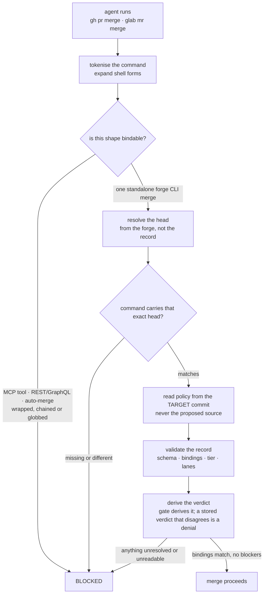

Two different things share the word "review", and confusing them is the most common way to
mis-describe this kit.

|             | Advisory review                                      | The merge gate                             |
| ----------- | ---------------------------------------------------- | ------------------------------------------ |
| Ships as    | `review-discipline.md`, in the `advisory-review` kit | `adversarial-review` skill kit             |
| Installed   | only on `--with advisory-review`                     | only on `--with adversarial-review`        |
| Enforcement | none — advisory                                      | `review-police` refuses the merge command  |
| Requires    | a reviewer that did not author the change            | a validated record bound to the exact head |

These are AgentKit's two review modes, and they are independent: enable either, both, or neither.
Neither is installed by default.

:::note[Both review modes are opt-in]
Both kits are marked `explicit` in the manifest. Neither is in `--all`, neither is ever offered by
the interactive picker, and only a literal `--with advisory-review` / `--with adversarial-review` installs one. When a run does not select one, the installer
**removes** what it previously installed for it — for the gate that is its hooks, its tools, its
skill, its instruction file, and its entries in `settings.json` and Codex's `hooks.json`; for the
advisory mode, its instruction file and every prompt block spliced from it.

With neither selected, nothing asks for a review and nothing blocks a merge. That is the intended
default for a harness whose own instructions already mandate a reviewer pass — carrying the rule
twice costs prompt weight on every session and buys nothing.
[Skill kits](/docs/getting-started/skill-kits/) covers selecting them.
:::

## The discipline

The maker never grades its own work. Before merging substantive work, one advisory review pass runs
in a context that did not author the change — a reviewer subagent where the harness supports one, a
fresh session otherwise.

Three details in it do most of the work:

- **Review the committed state**, via `git show` or `git diff <base>...HEAD` — never the working
  tree. A shared checkout can hold abandoned edits that were never proposed.
- **Probe, don't read.** Run the tests, execute the change, try to break it. Where the change adds a
  test or a guard, mutate what it claims to cover and confirm it fails; an assertion that cannot fail
  is not evidence.
- **Findings come back ranked, with a concrete failure scenario each**, and the author fixes them
  rather than arguing them down. After fixes, a delta re-review — full re-reviews are for new scope.

Trivial changes are exempt: typos, labels, comment wording, config value tweaks.

## The gate

With `adversarial-review` installed, a merge is refused unless a review record exists that is bound to
the **exact source head the forge is about to merge**.

Two properties of that flow are the whole design:

**The change never chooses its own judge.** Policy is read from the exact target commit. A branch
cannot weaken the rules that judge it. If the target commit or its policy state cannot be read, the
answer is deny — _unavailable is not absent_. A change that _adds_ the first policy is reviewed under
the bounded legacy shape, and the policy activates only once it has landed on the protected target.

**Disagreement is a denial.** The gate derives the verdict itself from the record's contents and
rejects a stored verdict that contradicts it.

### What the record has to carry

The record is validated field by field. Nine `context` fields are each required, type-checked, and
compared against what the gate derives: `forge`, `repository`, `repository_id`, `change_id`,
`source_branch`, `target_branch`, `source_sha`, `target_sha`, and `policy_digest` — the digest of the
policy read from the target commit. On top of that:

| Block          | Contents                                                                                                                               |
| -------------- | -------------------------------------------------------------------------------------------------------------------------------------- |
| `lanes`        | A diff lane and a product lane, each with a verdict; the product lane also carries coverage                                            |
| `findings`     | Lane, severity, summary, scenario, resolved — any unresolved blocker or high finding derives a blocked verdict                         |
| `claims`       | Each verified with evidence, or unverified with a reason; a tier may forbid unverified claims entirely                                 |
| `checks`       | Command plus outcome: passed at exit zero, failed with the code and reason, or **not run** with a reason                               |
| `analyses`     | Seven closed kinds: claims audit, falsification, failure trace, analogy differences, pattern sweep, new assumptions, artifact lifetime |
| `user_consent` | An explicit local override carrying a non-blank user quote and a timestamp — a _passing_ record must not carry one                     |

The `checks` block having three outcomes rather than two is deliberate. A check that shells out to an
external tool can run and pass, run and fail, or **never run** — and the third is the dangerous one,
because a skip reads like a pass in a column of green.

### Where the artifacts live

| Artifact            | Location                                              | Durable         |
| ------------------- | ----------------------------------------------------- | --------------- |
| Target-owned policy | `.agentkit/review-policy.json`                        | committed       |
| Product contract    | `.agentkit/product.yaml`                              | committed       |
| Local review index  | `.agentkit/reviews/<source-branch-slug>.json`         | no — gitignored |
| Evidence packet     | a redacted PR or MR comment, or a controlled artifact | yes             |
| Local gate audit    | `~/.agentkit/review-audit.log`                        | machine-local   |

The review record must never be committed: committing it changes the source SHA and immediately makes
its own binding stale.

### What the merge command itself must look like

The hook is as strict about the command as about the record, because a command it cannot parse is a
command it cannot bind. Refused outright, before any record is even looked for:

- **A merge through an MCP tool.** There is no shell command to inspect, so every command-shaped
  check is bypassed.
- **A direct REST or GraphQL merge.** The endpoint carries its own repository identity, which may
  differ from the checkout — resolving only its numeric id would let an approved local change
  authorise a same-numbered change elsewhere.
- **A merge-on-pipeline push option**, and any `--auto`, `--auto-merge`, or
  `--merge-when-pipeline-succeeds` flag. A deferred merge lands a head no review has seen.
- **Anything but one literal, top-level forge invocation.** The accepted shape is exactly
  `gh pr merge <id>` or `glab mr merge <id>`, flags after the numeric id. Newlines, `$`, backticks,
  shell operators, globs, a second `merge` token, a repeated `--repo` or head flag, or `--host` all
  refuse — `PreToolUse` sees the whole call once, so `git push B && glab mr merge 12` could change
  the head after the check.

Two positive requirements are easy to miss:

- The command must carry the **exact reviewed head** as a precondition — `--match-head-commit` on
  `gh`, `--sha` on `glab`. Missing counts the same as wrong. This makes the forge itself enforce the
  reviewed SHA, so the gap between the hook and the merge becomes a refused merge rather than an
  unreviewed one.
- On `glab` the command must **explicitly** pass `--auto-merge=false`, because current `glab`
  otherwise defers the merge while a pipeline runs.

A GitHub target that requires the merge queue is refused as well: the CLI merge is deferred there, so
protected merge-queue CI is the authoritative gate and a local evidence token cannot authorise it.

It over-blocks on purpose. A compound command that merely mentions a merge is refused — a false
denial is an inconvenience, and a missed merge is the failure the gate exists to prevent.

## Profiles decide effort, not authority

[`review-profile`](/docs/reference/cli-and-tools/) resolves how much review a change needs. Three presets: `fast` (primary review for
non-trivial work), `balanced` (the default — one primary review, with specialist and product lanes
risk-triggered), and `strict` (all lanes, full local checks, a fresh CI run).

The resolver is orchestration guidance. It **cannot** lower what the exact target commit's policy
requires, and target-owned policy can demand checks, product coverage, analyses or evidence that a
local profile omits. The same asymmetry applies to the config file: a repository's
`.agentkit/review-policy.json` can require stricter evidence and cannot be weakened by
`~/.config/agentkit/config.yaml`.

## What the gate proves

The gate proves **binding**: a review record satisfies it only when the record's context matches the
forge's exact source and target SHAs and the digest of the policy read from the target commit. That
makes the honest path correct and a stale review mechanically impossible to merge past by accident.

It is a consistency gate, not an authentication one. The record lives in the repository and the agent
can write it, so the gate does not attest reviewer identity, model-family independence, that a
recorded command ran, that evidence was redacted, or that a referenced link says what the record
claims. **Forge-side required approvals are what actually prevent a merge**, and the gate is designed
to sit alongside them.

That scope statement is repeated in the process doc, the gate validator, the hook itself, the
`evidence-gated-review` instruction, the README, and both review skills — so nobody has to go looking
for it.
