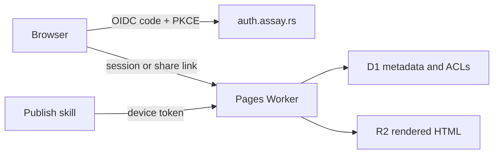

# AgentKit Pages Worker

The Worker serves the AgentKit site and authenticated Pages from one deployment. Assay is the
identity provider; AgentKit-specific ownership and sharing remain in D1.



## Bindings and configuration

| Name                 | Kind     | Purpose                                     |
| -------------------- | -------- | ------------------------------------------- |
| `PAGES`              | R2       | Site and rendered page bodies               |
| `DB`                 | D1       | Users, sessions, devices, pages, and grants |
| `SITE_TOKEN`         | Secret   | Marketing and documentation deployment only |
| `OIDC_CLIENT_SECRET` | Secret   | Confidential Assay client                   |
| `ACCOUNT_MODE`       | Variable | `required` fails closed without D1          |
| `PUBLIC_URL`         | Variable | Canonical Pages origin                      |
| `OIDC_ISSUER`        | Variable | Assay issuer                                |
| `OIDC_CLIENT_ID`     | Variable | Registered Assay client ID                  |
| `MAX_PAGES_PER_USER` | Variable | New-page quota; defaults to 100             |

`PUBLISH_TOKEN` may remain bound during migration, but account mode ignores it for page writes.
`SITE_TOKEN` remains independent and cannot address the page keyspace.

## Deployment

The publish workflow applies D1 migrations before deploying the Worker. It uses a D1-scoped token
for migrations and the existing Worker deployment token for the script itself. Never deploy a
Worker that references a schema migration before the migration has succeeded.

```sh
node node_modules/wrangler/bin/wrangler.js d1 migrations apply agentkit-pages --remote
node node_modules/wrangler/bin/wrangler.js deploy
```

New pages are private. An R2 page without a D1 metadata row is treated as a legacy public page so
the account rollout does not break existing URLs. Claiming legacy ownership is intentionally not
automatic: there is no trustworthy owner identity in the old shared token.
