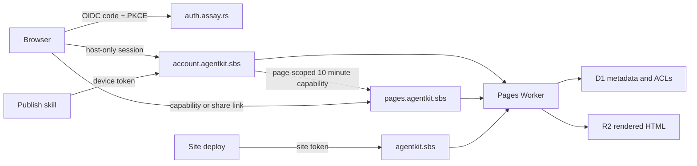

# AgentKit Pages Worker

The Worker serves three isolated origins from one deployment. Assay is the identity provider;
AgentKit-specific ownership and sharing remain in D1. User-authored HTML is confined to the Pages
origin and never shares an origin or session cookie with the account dashboard.



## Bindings and configuration

| Name                 | Kind     | Purpose                                     |
| -------------------- | -------- | ------------------------------------------- |
| `PAGES`              | R2       | Site and rendered page bodies               |
| `DB`                 | D1       | Users, sessions, devices, pages, and grants |
| `SITE_TOKEN`         | Secret   | Marketing and documentation deployment only |
| `OIDC_CLIENT_SECRET` | Secret   | Confidential Assay client                   |
| `SHARE_LINK_KEY`     | Secret   | HMAC key share tokens are derived from      |
| `ACCOUNT_MODE`       | Variable | `required` fails closed without D1          |
| `ACCOUNT_URL`        | Variable | Trusted dashboard and account API origin    |
| `PAGES_URL`          | Variable | Untrusted rendered-page origin              |
| `OIDC_ISSUER`        | Variable | Assay issuer                                |
| `OIDC_CLIENT_ID`     | Variable | Registered Assay client ID                  |
| `MAX_PAGES_PER_USER` | Variable | New-page quota; defaults to 100             |

`PUBLISH_TOKEN` may remain bound during migration, but account mode ignores it for page writes.
`SITE_TOKEN` remains independent and cannot address the page keyspace.

Private reads redirect through `ACCOUNT_URL/access`, which validates the signed-in owner or invite
and returns a random capability scoped to one page for ten minutes. The account cookie is host-only;
it is never sent to `PAGES_URL`. Removing an invite deletes that user's active capabilities.

## Deployment

The publish workflow applies D1 migrations before deploying the Worker. It uses a D1-scoped token
for migrations and the existing Worker deployment token for the script itself. Never deploy a
Worker that references a schema migration before the migration has succeeded.

```sh
node node_modules/wrangler/bin/wrangler.js d1 migrations apply agentkit-pages --remote
node node_modules/wrangler/bin/wrangler.js deploy
```

Migration `0006` and the `SHARE_LINK_KEY` secret are hard prerequisites of the current Worker:
every private-page read selects the share columns, and `required` account mode fails closed with
`503 share key unconfigured` until the secret is set. Share tokens are
`HMAC-SHA256(SHARE_LINK_KEY, share:<slug>:<generation>)`, so the key is load-bearing for every
circulating share link — rotating it invalidates all of them at once; treat rotation as a planned
migration, never routine hygiene.

New pages are private. An R2 page without a D1 metadata row is treated as a legacy public page so
the account rollout does not break existing URLs. Claiming legacy ownership is intentionally not
automatic: there is no trustworthy owner identity in the old shared token.
